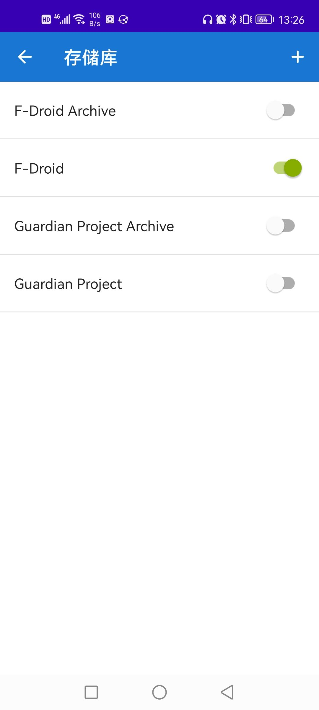
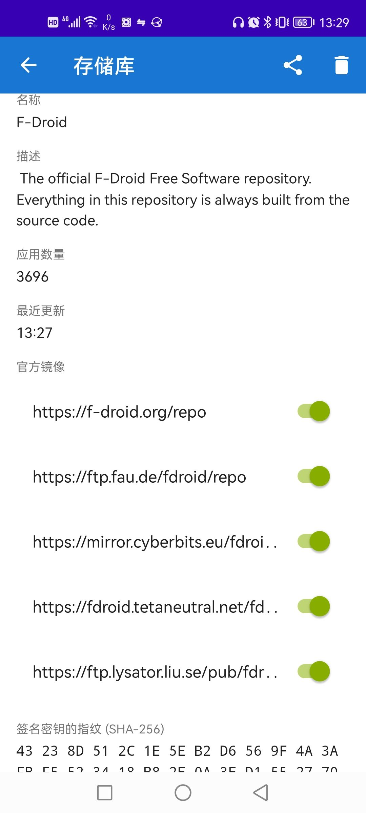
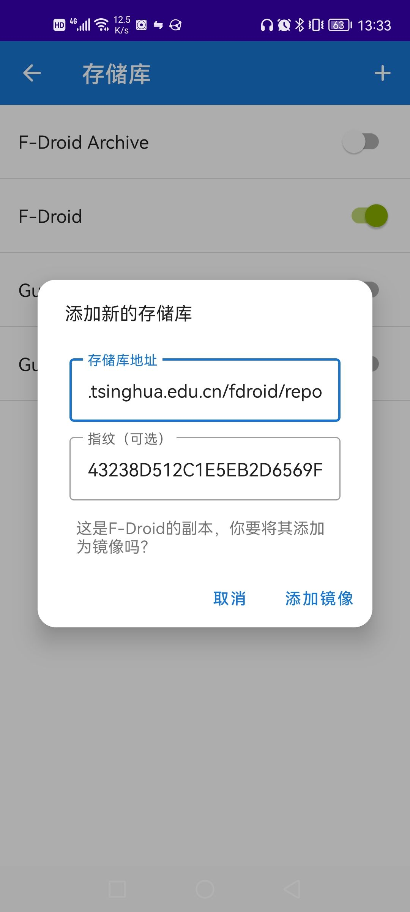
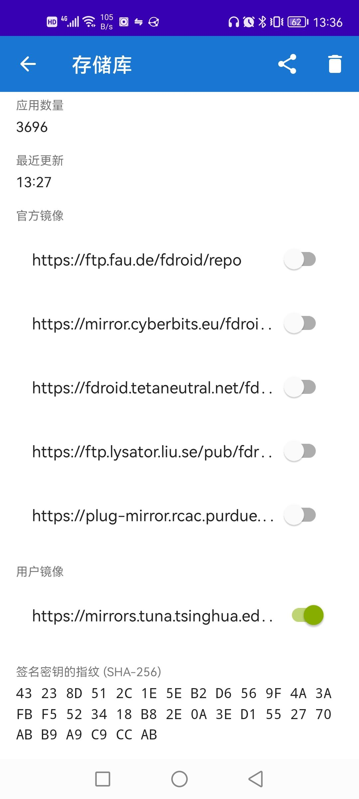

F-Droid下载地址：<https://f-droid.org/>

默认的官方源太慢了。建议更换清华源。官方教程：<https://mirrors.tuna.tsinghua.edu.cn/help/fdroid/>

先打开F-Droid，进入`设置->存储库`

点进`F-Droid`存储库，可能会看到一些官方镜像：

如果啥也没有，可能等一段时间就会出现。

把这些官方镜像全部取消勾选，不然可能会影响速度。注意这里其实有六个官方镜像，要向下滑才能看到第六个（坑死了）。

<!-- 如果有`Guardian Project Archive`和`Guardian Project Official Releases`的话，先取消勾选，因为这俩好像没有国内镜像，打开的话可能会影响速度。 -->

然后复制这个链接：<https://mirrors.tuna.tsinghua.edu.cn/fdroid/repo/?fingerprint=43238D512C1E5EB2D6569F4A3AFBF5523418B82E0A3ED1552770ABB9A9C9CCAB>

回到之前的存储库界面，点击右上角的加号，F-Droid会自动读取剪切板里的链接：

点击`添加镜像`，再进入`F-Droid`存储库，就能看到多了一个清华的用户镜像：

如果想添加`F-Droid Archive`存储库的清华镜像源的话，可以先把这个库的开关打开，然后复制链接：<https://mirrors.tuna.tsinghua.edu.cn/fdroid/archive?fingerprint=43238D512C1E5EB2D6569F4A3AFBF5523418B82E0A3ED1552770ABB9A9C9CCAB>

之后的流程跟上面的一样。目前不知道这个`Archive`库有啥用。我感觉可以不添加。

设置好存储库的镜像源之后，到`更新`界面，下划，更新一下库，就可以了。

这里推荐一些F-Droid上的不错的app：

## KeePassDX

密码管理软件。配合坚果云可以实现密码全平台同步。

## Termux

手机上的Linux命令行终端.

## Element

基于Matrix协议的去中心化即时聊天软件。可以自己搭聊天服务器，可以跨服聊天。支持端到端加密。

使用教程：

## syncthing

p2p同步。

## vanilla music

GPLv3协议的音乐播放器。以m3u后缀的文本方式保存歌单，可以把歌单跟歌曲一起用syncthing同步，歌单用相对路径。但是有些歌会乱码。

常用的插件：

metadata fetcher

lyrics search（中文歌好像很少能搜到歌词。。。）

## Fennec

相当于firefox国际版
