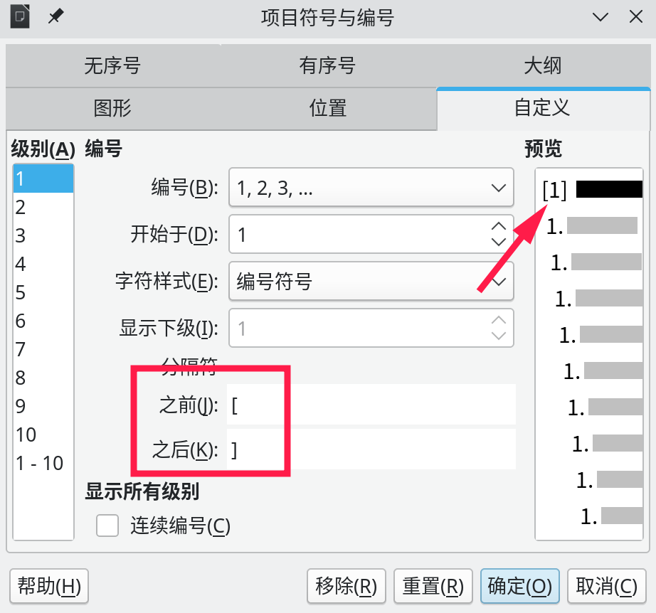
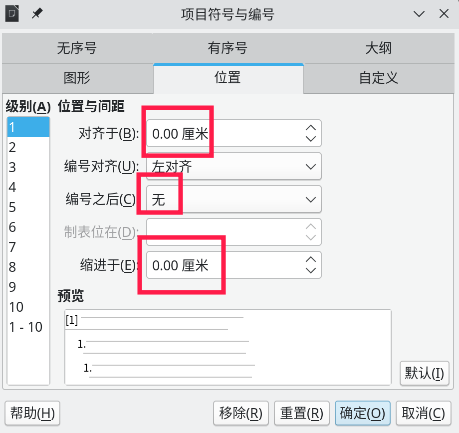
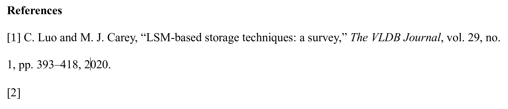
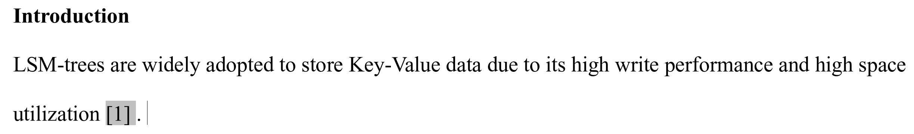

先把参考文献放到文章末尾，然后把这些文献全部选中，点击工具栏中的`切换有序号列表`的下拉按钮，点击`更多编号`，然后在`分隔符`的`之前`里填入`[`，在`之后`里填入`] `，注意右方括号后面有一个空格。这时预览里就可以看到风格变成了`[1] xxx`了。

然后再选择`位置`选项卡，将其中的`对齐于`和`缩进于`都设置成0，并且把`编号之后`设置成`无`。

然后参考文献的编号就搞定了：

接下来，将光标移动到需要引用文献的地方，选择`插入`->`交叉引用`，`类型`选择`编号的段落`，`引用形式`选择`编号`，然后在右边的选择框里双击要引用的文献，文献编号就被插入了：

虽然在编辑模式下这个编号是灰色的，但是打印出来是白底的，可以在`文件`->`打印预览`里确认这一点。如果要让这个编号放到右上角，那就选中它，然后点击工具栏中的`上标`即可。

参考：[怎么在Word中自动引用参考文献](https://jingyan.baidu.com/article/54b6b9c0a379d02d583b47b8.html)
