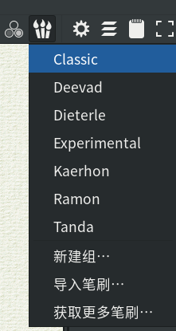
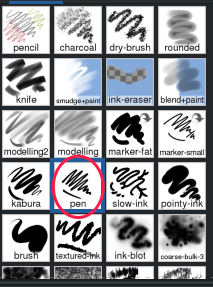
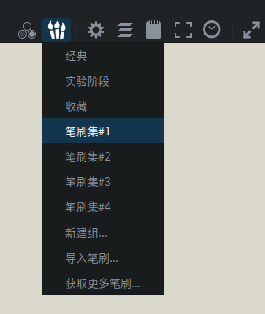
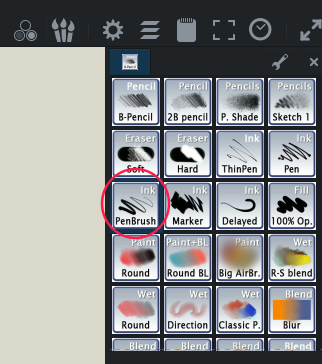
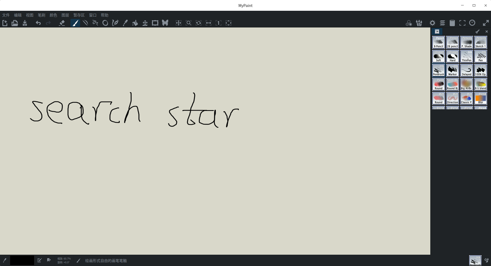

无限大，可缩放，但是默认的笔刷有点淡，可以换成钢笔：点右上角的笔刷组列表，按照版本的不同，选择方法如下。

## v2.0.1

选择classic

然后选pen

## v1.2.0

可以选笔刷集1

然后选这个

就很合适了。

但是这个软件写的东西多了之后会很卡。这里提供了更多选择：<https://seekstar.github.io/2021/12/28/linux%E8%8D%89%E7%A8%BF%E7%BA%B8%E8%BD%AF%E4%BB%B6/>
