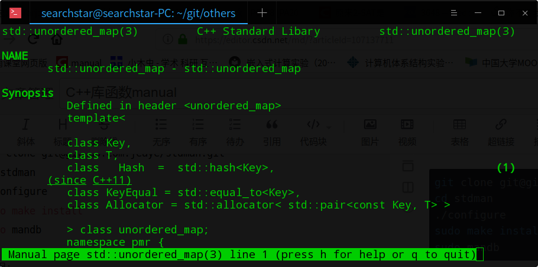

# 在线
```shell
sudo apt install -y cppman
cppman next_permutation
```

# 离线
```shell
git clone git@github.com:jeaye/stdman.git
cd stdman
./configure
sudo make install
sudo mandb
```
使用：
```shell
man std::unordered_map
```

但是貌似不能跳转。。。
