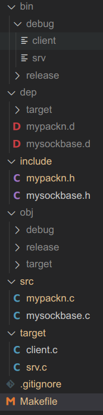

目录结构：

```Makefile
# Works only when there is only one target
# You may want to modify it
run_debug: debug
	./$(TARGETS_EXE_DEBUG)

# Works only when there is only one target
# You may want to modify it
run_release: release
	./$(TARGETS_EXE_RELEASE)


CC				:= gcc
FLAGS_DEBUG 	:= -g
FLAGS_RELEASE 	:= -O3

BIN_DEBUG	:= bin/debug
BIN_RELEASE 	:= bin/release
SRC		:= src
SRCS		:= $(wildcard $(SRC)/*.c)
TARGET		:= target
TARGETS		:= $(wildcard $(TARGET)/*.c)
INCLUDE		:= include
LIB		:= lib

LIBRARIES	:=

OBJ_DEBUG	:= obj/debug
OBJS_DEBUG	:= $(patsubst $(SRC)/%.c,$(OBJ_DEBUG)/%.o,$(SRCS))
OBJ_TARGET_DEBUG	:= obj/target/debug
OBJS_TARGET_DEBUG	:= $(patsubst $(TARGET)/%.c,$(OBJ_TARGET_DEBUG)/%.o,$(TARGETS))

OBJ_RELEASE	:= obj/release
OBJS_RELEASE	:= $(patsubst $(SRC)/%.c,$(OBJ_RELEASE)/%.o,$(SRCS))
OBJ_TARGET_RELEASE	:= obj/target/release
OBJS_TARGET_RELEASE	:= $(patsubst $(TARGET)/%.c,$(OBJ_TARGET_RELEASE)/%.o,$(TARGETS))

DEP			:= dep
DEPS		:= $(patsubst $(SRC)/%.c,$(DEP)/%.d,$(SRCS))
DEP_TARGET	:= dep/target
DEPS_TARGET	:= $(patsubst $(TARGET)/%.c,$(DEP_TARGET)/%.d,$(TARGETS))

ifeq ($(OS),Windows_NT)
TARGETS_EXE_DEBUG	:= $(patsubst $(TARGET)/%.c,$(BIN_DEBUG)/%.exe,$(TARGETS))
TARGETS_EXE_RELEASE	:= $(patsubst $(TARGET)/%.c,$(BIN_RELEASE)/%.exe,$(TARGETS))
RM 			:= del
MKDIR			:= mkdir
else
TARGETS_EXE_DEBUG	:= $(patsubst $(TARGET)/%.c,$(BIN_DEBUG)/%,$(TARGETS))
TARGETS_EXE_RELEASE	:= $(patsubst $(TARGET)/%.c,$(BIN_RELEASE)/%,$(TARGETS))
RM 			:= rm -f
MKDIR			:= mkdir -p
endif

clean_debug:
	$(RM) $(TARGETS_EXE_DEBUG) $(OBJS_DEBUG) $(OBJS_TARGET_DEBUG)

clean_release:
	$(RM) $(TARGETS_EXE_RELEASE) $(OBJS_RELEASE) $(OBJS_TARGET_RELEASE)

clean:	clean_debug clean_release
	$(RM) $(DEPS) $(DEP)/*.d.* $(DEPS_TARGET) $(DEP_TARGET)/*.d.*


$(DEP)/%.d: $(SRC)/%.c
	@set -e; \
	$(MKDIR) $(DEP); \
	$(RM) $@; \
	$(CC) -MM -I$(INCLUDE) $< > $@.$$$$; \
	sed 's,^.*:,$@ $(OBJ_DEBUG)/$(patsubst $(SRC)/%.c,%,$<).o $(OBJ_RELEASE)/&,g' < $@.$$$$ > $@; \
	$(RM) $@.$$$$

$(DEP_TARGET)/%.d: $(TARGET)/%.c
	@set -e; \
	$(MKDIR) $(DEP_TARGET); \
	$(RM) $@; \
	$(CC) -MM -I$(INCLUDE) $< > $@.$$$$; \
	sed 's,^.*:,$@ $(OBJ_TARGET_DEBUG)/$(patsubst $(TARGET)/%.c,%,$<).o $(OBJ_TARGET_RELEASE)/&,g' < $@.$$$$ > $@; \
	$(RM) $@.$$$$

-include $(DEPS)
-include $(DEPS_TARGET)


$(OBJ_DEBUG)/%.o: $(SRC)/%.c $(DEP)/%.d
	$(MKDIR) $(OBJ_DEBUG)
	$(CC) $(FLAGS_DEBUG) -c -I$(INCLUDE) -L$(LIB) $< -o $@

$(OBJ_TARGET_DEBUG)/%.o: $(TARGET)/%.c $(DEP_TARGET)/%.d
	$(MKDIR) $(OBJ_TARGET_DEBUG)
	$(CC) $(FLAGS_DEBUG) -c -I$(INCLUDE) -L$(LIB) $< -o $@

$(BIN_DEBUG)/%: $(OBJS_DEBUG) $(OBJ_TARGET_DEBUG)/%.o
	$(MKDIR) $(BIN_DEBUG)
	$(CC) $^ -o $@ $(LIBRARIES)

debug: $(TARGETS_EXE_DEBUG)


$(OBJ_RELEASE)/%.o: $(SRC)/%.c $(DEP)/%.d
	$(MKDIR) $(OBJ_RELEASE)
	$(CC) $(FLAGS_RELEASE) -c -I$(INCLUDE) -L$(LIB) $< -o $@

$(OBJ_TARGET_RELEASE)/%.o: $(TARGET)/%.c $(DEP_TARGET)/%.d
	$(MKDIR) $(OBJ_TARGET_RELEASE)
	$(CC) $(FLAGS_RELEASE) -c -I$(INCLUDE) -L$(LIB) $< -o $@

$(BIN_RELEASE)/%: $(OBJS_RELEASE) $(OBJ_TARGET_RELEASE)/%.o
	$(MKDIR) $(BIN_RELEASE)
	$(CC) $^ -o $@ $(LIBRARIES)

release: $(TARGETS_EXE_RELEASE)

.PHONY: clean_debug clean_release clean debug run_debug release run_release
```
执行
```shell
make debug
```
可以把target文件夹里的`.c`文件都编译成可执行文件。

# 参考：
<https://www.cnblogs.com/lidabo/p/4928956.html>
<https://www.linuxidc.com/Linux/2016-02/128726p3.htm>
<https://www.gnu.org/software/make/manual/html_node/Include.html>

# 解释：
## ＠set -e
当脚本执行出现意料之外的情况时，立即退出，避免错误被忽略，导致最终结果不正确。
加了@表示makefile执行这条命令时不显示出来。 

## patsubst
```
DEP			:= dep
DEPS		:= $(patsubst $(SRC)/%.cpp,$(DEP)/%.d,$(SRCS))

在$(SRCS)中找模式“$(SRC)/%.cpp”，然后把其中的“%”对应的部分贴到$(DEP)/%.d的"%"处
```

# 坑点
## 1
如果把
```
-include $(DEPS)
```
打成
```
-include $(DPES)
```
则执行完Makefile之后会自动执行rm把生成的.d文件全部删掉。因为Makefile（好像）会自动把没有被用到的文件删除。

## 2
<https://blog.csdn.net/iosxiaoming/article/details/47669529>
在makefile中有一个dir命令和一个basename命令，然后在shell中也有basename函数和dirname函数，两个是不相同的，在makefile中，`$(basename  NAMES)`函数功能是取出各个文件的前缀部分，dir命令`$(dir NAMES)`指的是取出各个文件名的目录部分，文件名的目录部分就是包含在文件名中的最后一个斜线之前的部分,而在shell中，basename命令能从路径中分离出文件名，及取出文件名部分，dirname的作用则和basename正好相反，它返回路径部分。

## 3
patsubst中的空格是有含义的，例如在逗号后面加空格，那个空格是算在后面那个字符串的。
例如
`$(patsubst a, b,g)`
（注：b前面有一个空格）
会把a替换为 <空格>b，这样有时会出问题。因此建议不要乱加空格。


# 遇到的错误以及解决方案：
## 报错：“sed:-e 表达式 #1,字符 22:“s”的未知选项”
解决方案：
<https://www.cnblogs.com/lemon-le/p/6020695.html>
