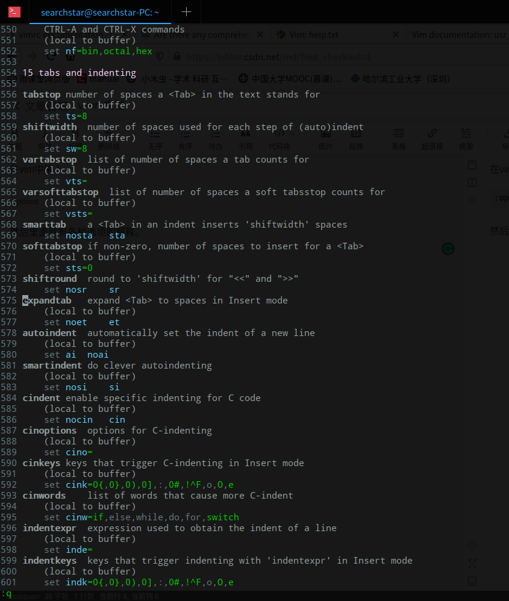

参考：<https://vi.stackexchange.com/questions/13398/are-there-any-comprehensive-docs-for-vimrc>

在vim中输入

```text
:options
```

然后里面就有各种选项的解释。


## 将缩进设置为空格

比如设置成4个空格：

```vim
" tabstop: number of spaces a <Tab> in the text stands for
set ts=4
" softtabstop: if non-zero, number of spaces to insert for a <Tab>
" Makes backspace in insert mode delete four spaces at once.
set sts=4
" expandtab: expand <Tab> to spaces in Insert mode
set et
" smartindent: do clever autoindenting
set si
" shiftwidth: number of spaces used for each step of (auto)indent
set sw=4
```
