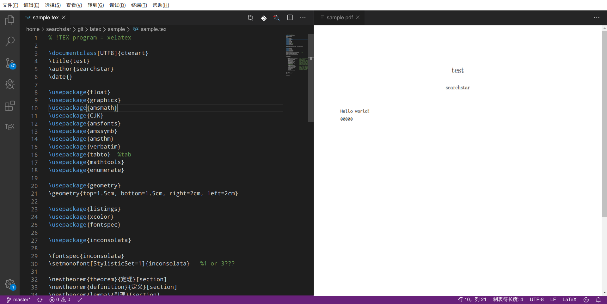

## 英文写作

测试环境：Debian 11

英文写作通常使用pdflatex。

```shell
# pdflatex
sudo apt install texlive-latex-base
# xkeyval.sty
sudo apt install texlive-latex-recommended
# xstring.sty
sudo apt install texlive-latex-extra
# libertine
sudo apt install texlive-fonts-extra
```

## 中文写作

测试环境：deepin 15.11

由于xetex对中文的支持较好，为了节约磁盘空间和安装时间，就只安装xetex。

在终端中执行以下命令

```shell
sudo apt-get install -y texstudio perl-tk 
sudo apt-get install -y texlive-xetex
#Install chinese font package
sudo apt-get install -y latex-cjk-all
#Install fonts such as consolas
sudo apt-get install -y texlive-fonts-extra
#也许可以不要？
sudo apt-get install -y texlive-lang-english texlive-lang-chinese
```

安装时间较长。安装完后就可以使用vim或vscode或texstudio编写latex了。

样例（第一行用于指定编译器）：

```tex
% !TEX program = xelatex

\documentclass[UTF8]{ctexart}
\title{test}
\author{searchstar}
\date{}

\usepackage{float}
\usepackage{graphicx}
\usepackage{amsmath}
\usepackage{CJK}
\usepackage{amsfonts}
\usepackage{amssymb}
\usepackage{amsthm}
\usepackage{verbatim}
\usepackage{tabto}	%tab
\usepackage{mathtools}
\usepackage{enumerate}

\usepackage{geometry}
\geometry{top=1.5cm, bottom=1.5cm, right=2cm, left=2cm}

\usepackage{listings}
\usepackage{xcolor}
\usepackage{fontspec}

\usepackage{inconsolata}

\fontspec{inconsolata}
\setmonofont[StylisticSet=1]{inconsolata}	%1 or 3???

\newtheorem{theorem}{定理}[section]
\newtheorem{definition}{定义}[section]
\newtheorem{lemma}{引理}[section]

\begin{document}
	\maketitle
	
	\lstset{ %  
		backgroundcolor=\color{white},   % choose the background color; you must add \usepackage{color} or \usepackage{xcolor}  
		basicstyle=\ttfamily,			 %ttfamily is consolas
		breakatwhitespace=false,         % sets if automatic breaks should only happen at whitespace  
		breaklines=true,                 % sets automatic line breaking  
		deletekeywords={...},            % if you want to delete keywords from the given language  
		escapeinside={\%*}{*)},          % if you want to add LaTeX within your code  
		extendedchars=true,              % lets you use non-ASCII characters; for 8-bits encodings only, does not work with UTF-8  
		keepspaces=true,                 % keeps spaces in text, useful for keeping indentation of code (possibly needs columns=flexible)  
		morekeywords={*,...},            % if you want to add more keywords to the set  
		% numbers=left,                    % where to put the line-numbers; possible values are (none, left, right)  
		numbersep=5pt,                   % how far the line-numbers are from the code  
		numberstyle=\ttfamily,
		rulecolor=\color{black},         % if not set, the frame-color may be changed on line-breaks within not-black text (e.g. comments (green here))  
		showspaces=false,                % show spaces everywhere adding particular underscores; it overrides 'showstringspaces'  
		showstringspaces=false,          % underline spaces within strings only  
		showtabs=false,                  % show tabs within strings adding particular underscores  
		stepnumber=1,                    % the step between two line-numbers. If it's 1, each line will be numbered  
		tabsize=4,                       % sets default tabsize to 2 spaces  
		columns=fullflexible,
	}

	\begin{lstlisting}
Hello world!
00000
	\end{lstlisting}

\end{document}
```

保存为sample.tex

以下三种方法任选一种

- 用texstudio打开，按F5即可编译并查看。

- 用vscode打开，安装插件LaTeX language support，LaTeX Workshop，latex-formatter，然后重启vscode，回到刚刚打开的sample.tex的文本界面，按ctrl+s即可编译，然后点击右上角的这个图标


就可以预览编译结果了。


- 使用vim

在~/.vim下新建一个tex.vimrc，内容：

```vimrc
set ts=4
set sw=4
set softtabstop=4
set smartindent	" next level indent

func! Compile_pdflatex()
	exec "!pdflatex %"
endfunc

func! Compile_xelatex()
	exec "!xelatex %"
endfunc

func! View()
	exec "!evince %<.pdf&"
endfunc

map <F6> :w<CR>:call Compile_pdflatex()<CR>
map <F7> :w<CR>:call View()<CR>
map <F5> <F6><F7>

map <C-F9> :w<CR>:call Compile_xelatex()<CR>
map <F9> <C-F9><F7>
```

其中evince是一种文档查看器，如果没有可以自己安装。

在~/.vimrc中加入：

```vimrc
syntax on
set nu
set autoindent	" same level indent

map <C-A> ggvG$"+y
autocmd FileType tex source ~/.vim/tex.vimrc
```

保存退出后重启vim，然后用vim打开sample.tex文件，按F9即可编译并预览。

有时可能需要重启电脑才能使tex.vimrc的配置生效。如果还没有生效，就重启两次（手动狗头）。如果还不行，就把tex.vimrc中的内容直接搬到~/.vimrc里，然后把autocmd那行删掉。
