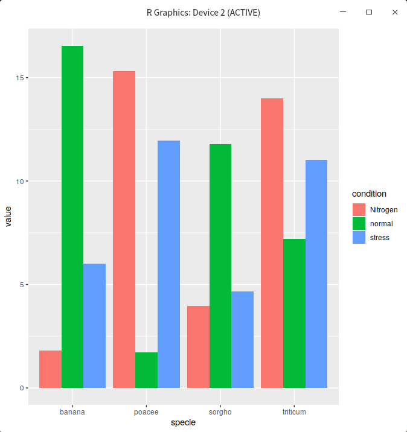
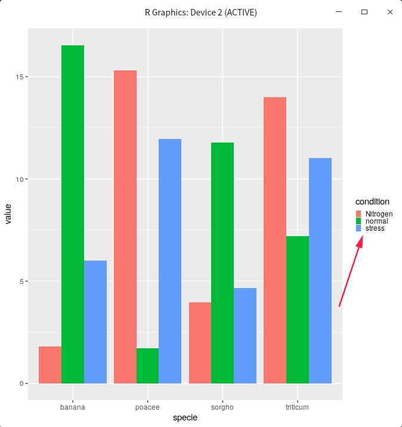

参考：<https://www.cnblogs.com/emanlee/p/5373649.html>

先放一个[gallery](https://www.r-graph-gallery.com/48-grouped-barplot-with-ggplot2.html)里的例子
```R
 # library
library(ggplot2)
 
# create a dataset
specie <- c(rep("sorgho" , 3) , rep("poacee" , 3) , rep("banana" , 3) , rep("triticum" , 3) )
condition <- rep(c("normal" , "stress" , "Nitrogen") , 4)
value <- abs(rnorm(12 , 0 , 15))
data <- data.frame(specie,condition,value)
 
# Grouped
ggplot(data, aes(fill=condition, y=value, x=specie)) + 
    geom_bar(position="dodge", stat="identity")
```

然后改theme里的`legend.key.size`就好了
```R
last_plot() + theme(legend.key.size = unit(0.1, "inches"))
```

图例就变小了。然后还可以通过调整`legend.margin`来调整图例四周的空白区域的大小，这在把图例嵌入到图中时很有用。
