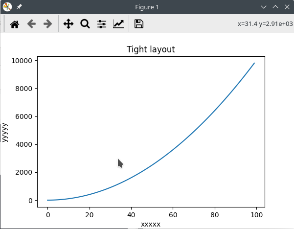
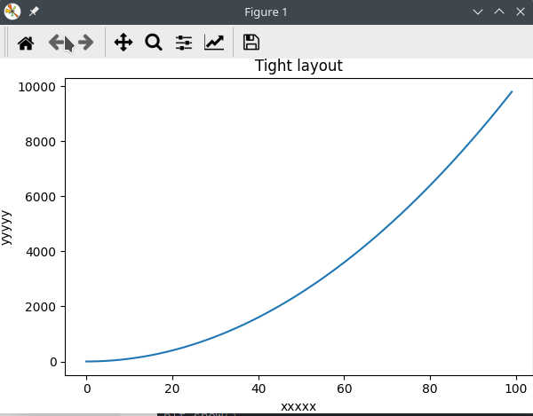
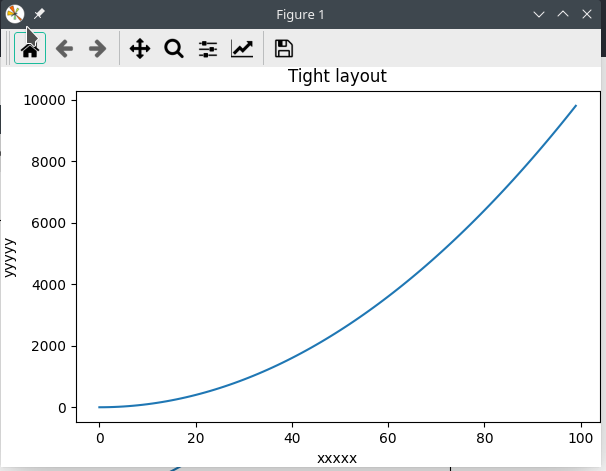

```py
plt.tight_layout(pad = 0)
```
如果右边界没了就
```py
plt.tight_layout(pad = 0.1)
```

例子：
原来的
```py
xx = np.arange(0, 100)
yy = xx * xx
plt.plot(xx, yy)
plt.title("Tight layout")
plt.xlabel("xxxxx")
plt.ylabel("yyyyy")
plt.show()
```



加上
```py
xx = np.arange(0, 100)
yy = xx * xx
plt.plot(xx, yy)
plt.title("Tight layout")
plt.xlabel("xxxxx")
plt.ylabel("yyyyy")
plt.tight_layout(pad = 0)
plt.show()
```



不过右边界没了。不喜欢的话把pad改成0.1

```py
xx = np.arange(0, 100)
yy = xx * xx
plt.plot(xx, yy)
plt.title("Tight layout")
plt.xlabel("xxxxx")
plt.ylabel("yyyyy")
plt.tight_layout(pad = 0.1)
plt.show()
```


