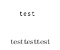
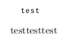

转自：<https://tex.stackexchange.com/questions/167305/how-do-i-get-rid-of-the-extra-blank-line-at-the-end-of-my-listing>

如果在`lstset`里设置了`keepspaces=true`，那代码后面可能会跟一个空行，例如
```tex
	\begin{lstlisting}
	test
	\end{lstlisting}
	testtesttest
```


后面有一个空行。这是因为\end{lstlisting}前仍然有一个newline。所以需要把\end{lstlisting}提前。
```tex
	\begin{lstlisting}
	test\end{lstlisting}
	testtesttest
```


空行就没有了。
