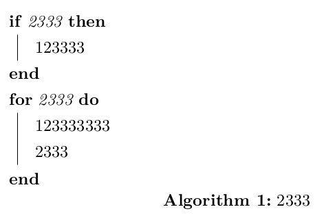
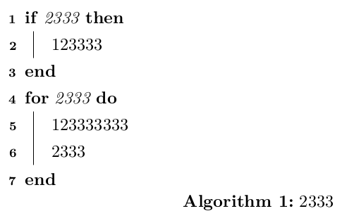
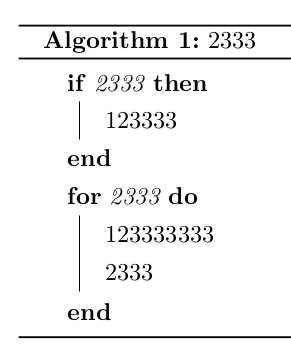
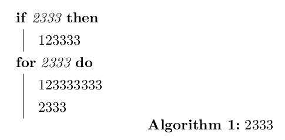
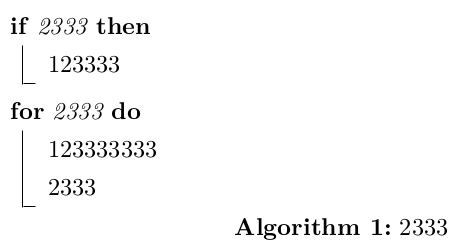

完整参数见官方文档：<http://tug.ctan.org/macros/latex/contrib/algorithm2e/doc/algorithm2e.pdf>

这里介绍几个常用的。

测试代码：

```tex
\documentclass[UTF8]{ctexart}

\usepackage[linesnumbered, ruled, vlined]{algorithm2e}

\begin{document}

\begin{algorithm}
	\caption{2333}\label{alg:xxx}
	\DontPrintSemicolon
	\If{2333}{
		123333 \;
	}
	\For{2333}{
		123333333 \;
		2333 \;
	}
\end{algorithm}

\end{document}
```

## 啥参数都没有



## linesnumbered

标上行号。



## ruled



## noend



## vlined

默认使用`\SetAlgoVlined`。


