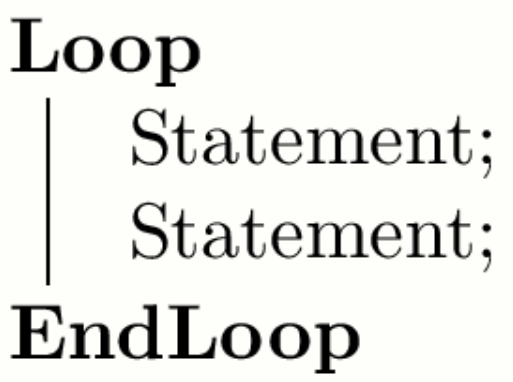

```tex
\documentclass{article}
\usepackage{algorithm2e}
\begin{document}
\thispagestyle{empty}

\SetKwFor{Loop}{Loop}{}{EndLoop}

\begin{algorithm}
  \Loop{}{Statement\;Statement\;}
\end{algorithm}
\end{document}
```



原文：<https://tex.stackexchange.com/questions/148414/infinite-loop-with-algorithm2e>
