## 别人的博客

[各种width](https://www.latexstudio.net/archives/4257)
[各种空格](https://blog.csdn.net/seaskying/article/details/51316607)

## 符号

<https://en.wikibooks.org/wiki/LaTeX/Mathematics>

[希腊字母](https://blog.csdn.net/lanchunhui/article/details/49819445)

[Latex常用数学符号输入方法](https://jingyan.baidu.com/article/4b52d702df537efc5c774bc9.html)

### 杂项

| 名字 | 符号 | 代码 | 备注 |
| ---- | ---- | ---- | ---- |
| 自然连接 | $\bowtie$ | \\bowtie | [latex如何输入自然连接 ⋈](https://zhidao.baidu.com/question/616102177995456132.html) |
| 并且 | $\wedge$ | \\wedge | |
| 或者 | $\vee$ | \\vee | |
| 并 | $\cup$ | \\cup | [Latex——交集、并集](https://blog.csdn.net/qq_36825778/article/details/102627703) |
| 交 | $\cap$ | \\cap | [Latex——交集、并集](https://blog.csdn.net/qq_36825778/article/details/102627703) |
| 包含于 | $\subseteq$ | \\subseteq | |
| 积分 | $\int$ | \\int | [latex如何输入积分号](https://jingyan.baidu.com/article/597a06433705da312b524300.html) |
| 微分 | $\mathrm{d}x$ | \\mathrm{d}x | 更规范的方法：[LaTeX技巧898：在LaTeX中使用微分算子的正确姿势](https://www.latexstudio.net/archives/10115.html) |
| 无穷 | $\infty$ | \\infty | [latex无穷大](https://blog.csdn.net/qq_43539664/article/details/108966105) |
| 组合数 | $\binom{n}{m}$ 或者 $C_n^m$ | \\binom{n}{m} 或者 C_n^m | [LaTex排版技巧：[11]如何输入组合数？](https://jingyan.baidu.com/article/915fc414f5dbe351384b2043.html) |
| 约等号 | $\approx$ | \\approx | [Latex 约等于](https://blog.csdn.net/qq_42067550/article/details/106868884) |

### 各种箭头

| 符号 | 代码 |
| ---- | ---- |
| $\leftarrow$ | \\leftarrow |
| $\rightarrow$ | \\rightarrow |
| $\leftrightarrow$ | \\leftrightarrow |
| $\Leftarrow$ | \\Leftarrow |
| $\Rightarrow$ | \\Rightarrow |
| $\Leftrightarrow$ | \\Leftrightarrow |

完整版：[如何用LaTeX打出各种箭头？](https://zhuanlan.zhihu.com/p/263896738)

### 符号上面的横杠等

| 样式 | 效果 | 代码 |
| ---- | ---- | ---- |
| 横杠 | $\bar{a}$ | \\bar{a} |
| 波浪线 | $\tilde{a}$ | \\tilde{a} |
| 长波浪线 | $\widetilde{aaa}$ | \\widetilde{aaa} |
| 点 | $\dot{a}$ | \\dot{a} |
| hat | $\hat{a}$ | \\hat{a} |

完整版：[latex 字母上面加符号](https://blog.csdn.net/dlaicxf/article/details/52680666)

## 技巧

1. 在enumerate中的item后换行用\par，这样与正文之间会有一条缝隙。
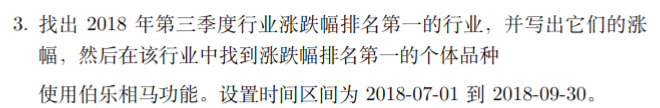
如果使用`\\`换行则标题与正文之间没有缝隙，很难看
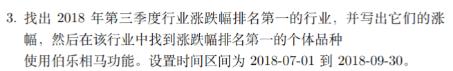

## 公式中插入中文

```tex
\text{中文}
```

## 左引号

参考：<https://blog.csdn.net/dyzok88/article/details/44222765>

左单引号（键盘上1左边那个）`` ` ``

 左双引号（按两下键盘上1左边的按键）``` `` ```

## 把下标放到正下方

### 使用underset

这种方法可用于任何符号

```tex
\underset{theta}{\bowtie}
```

效果

$$\underset{theta}{\bowtie}$$

感谢RMan大佬告知。

### 使用limits

参考：<https://zhidao.baidu.com/question/873705252499505652.html>

仅限于放到数学运算符下方

```tex
\sum\limits_{i=1}
```

效果：

$$\sum\limits_{i=1}$$

若是普通符号，那么要用\mathop先转成数学运算符再用\limits

```tex
\mathop{\bowtie}\limits_{theta}
```

效果：

$$\mathop{\bowtie}\limits_{theta}$$

## 插入图片

### 单张图片

参考：

<https://zhidao.baidu.com/question/556236943.html>

<https://www.jianshu.com/p/5f342de813d9>

```tex
\usepackage{graphicx}
```

```tex
\begin{figure}
\center\includegraphics[width=\textwidth]{img/condition.png}
\caption{标题}
\end{figure}
```

其中`\center`表示图片位置居中，`width=\textwidth`表示宽度与页面等宽，`img/condition.png`是图片文件的相对位置。
如果不想让图片乱动，可以加`[H]`选项

```tex
\begin{figure}[H]
```

但是前面要

```tex
\usepackage{float}
```

### 嵌套图片

参考：

<https://blog.csdn.net/yq_forever/article/details/84796802>

<https://blog.csdn.net/mifangdebaise/article/details/95871208>

```tex
\begin{figure}[H]
    \begin{center}
        \subfigure{
            \includegraphics[width=0.98\textwidth]{img/国债1.png}
        }
        \subfigure{
            \includegraphics[width=0.98\textwidth]{img/国债2.png}
        }
    \end{center}
\end{figure}
```

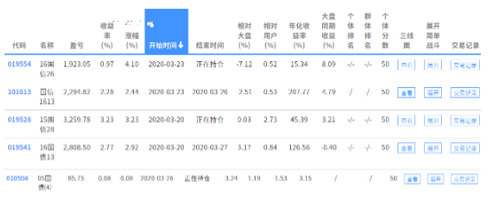
两张图片就被放在一起了。如果用单张图片的方式则会使得两张图片之间的间隔很大。

### 绕排

<https://www.zhihu.com/question/26837705>
[wrapfigure指定行数](https://seekstar.github.io/2020/04/20/latex-wrapfigure%E6%8C%87%E5%AE%9A%E8%A1%8C%E6%95%B0/)

## 枚举

### 编号

使用enumerate。可以自定义enumerate的编号样式。
自定义编号样式时要用到的包：

```tex
\usepackage{enumerate}
```

它的使用非常直观。例如要实现这样的编号样式

```
1)
2)
```

就这样

```tex
\begin{enumerate}[1)]
```

如果要

```
(a)
(b)
```

就

```tex
\begin{enumerate}[(a)]
```

或者这样

```
1、
2、
3、
```

```tex
\begin{enumerate}[1、]
```

### 小圆点

```tex
\begin{itemize}
    \item aaaa \par
    bbb
    \item ccc \par
    \item ddddd
\end{itemize}
```

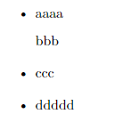

## 插入表格

### 基本表格

```tex
\begin{tabular}{|c|c|c|c|c|}
    \hline
    & A & B & C & D \\
    \hline
    $P_0$ & 0 & 1 & 0 & 0 \\
    \hline
    $P_1$ & 0 & 4 & 2 & 1 \\
    \hline
    $P_2$ & 1 & 0 & 0 & 1 \\
    \hline
    $P_3$ & 0 & 0 & 2 & 0 \\
    \hline
    $P_4$ & 0 & 6 & 4 & 2 \\
    \hline
\end{tabular}
```

- `|c|`: 居中并且单元格两侧添加竖线。(Centering)
- hline: 水平线（Horizontal LINE)

效果
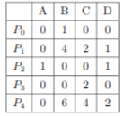

### 合并单元格

```tex
\usepackage{multirow}
```

```tex
\begin{tabular}{|c|c|c|c|c|}
    \hline
    \multirow{2}*{进程} %纵向合并2行单元格
    &
    \multicolumn{4}{|c|}{Work} \\
    \cline{2-5} %为2到5列添加横线
    & A & B & C & D \\
    \hline
    & 1 & 5 & 2 & 0 \\
    \hline
    $P_0$ & 1 & 6 & 3 & 0 \\
    \hline
    $P_3$ & 1 & 12 & 6 & 2 \\
    \hline
    $P_1$ & 2 & 14 & 9 & 3 \\
    \hline
    $P_2$ & 3 & 17 & 15 & 8 \\
    \hline
    $P_4$ & 3 & 17 & 16 & 12 \\
    \hline
\end{tabular}
```

- cline: [Column LINE](https://www.giss.nasa.gov/tools/latex/ltx-214.html)
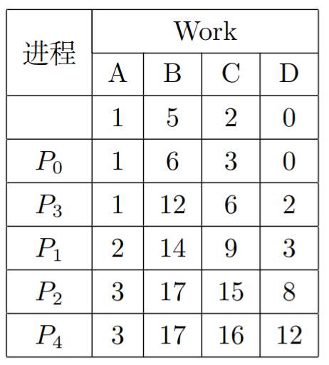

### 居中

- 使用center环境

```tex
\begin{center}
    \begin{tabular}{|c|c|c|c|c|}
        ........
    \end{tabular}
\end{center}
```

- 使用table环境，设置\center属性

```tex
\begin{table}
    \centering
    \begin{tabular}{|c|c|c|c|c|}
    	...........
    \end{tabular}
\end{table}
```

如果不想让它乱跑可以用`\begin{table}[H]`，但是要加上`\usepackage{float}`

### 设置标题

参考：<https://blog.csdn.net/wkd22775/article/details/51791553>

用`\caption{标题}`

#### 放在表上方

```tex
\begin{table}
    \centering
    \caption{23333}
    \begin{tabular}{|c|c|c|}
        \hline
        A & B & C \\
        \hline
        D & 1 & 2 \\
        \hline
        E & 3 & 4 \\
        \hline
    \end{tabular}
\end{table}
```

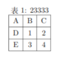

#### 放到表下面

把`\caption{标题}`放到`\end{table}`前面

```tex
\begin{table}
    \centering
    \begin{tabular}{|c|c|c|}
        \hline
        A & B & C \\
        \hline
        D & 1 & 2 \\
        \hline
        E & 3 & 4 \\
        \hline
    \end{tabular}
    \caption{23333}
\end{table}
```

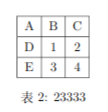

#### 不自动给标题编号

参考：<https://zhidao.baidu.com/question/616239100442857532.html>

直接把标题作为表的一行就好了。

```tex
\begin{tabular}{|c|c|c|}
    \multicolumn{3}{c}{23333}\\
    \hline
    A & B & C \\
    \hline
    D & 1 & 2 \\
    \hline
    E & 3 & 4 \\
    \hline
\end{tabular}
```

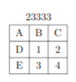

#### 去掉左边的缩进

默认情况下，tabular左边可能会有缩进，如图

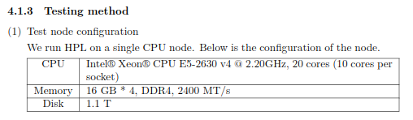

如果不想要这个缩进，将tabular包裹在一个`table`环境中即可。

```tex
	\begin{enumerate}
	\item 有缩进！\par
		\begin{tabular}{|c|c|c|}
			\multicolumn{3}{c}{23333}\\
			\hline
			A & B & C \\
			\hline
			D & 1 & 2 \\
			\hline
			E & 3 & 4 \\
			\hline
		\end{tabular}
	\item 没缩进了！\par
		\begin{table}[H]
		\begin{tabular}{|c|c|c|}
			\multicolumn{3}{c}{23333}\\
			\hline
			A & B & C \\
			\hline
			D & 1 & 2 \\
			\hline
			E & 3 & 4 \\
			\hline
		\end{tabular}
		\end{table}
	\end{enumerate}
```

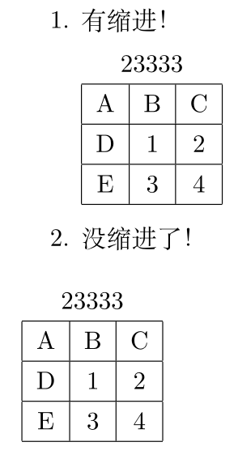


## 设置页边距

```tex
\usepackage{geometry}
\geometry{top=1.5cm,bottom=1.5cm, left=1.5cm, right=1.5cm}
```

## 插入公式

```tex
\usepackage{amsmath}
```

### 等式

`equation*`中的`*`表示不要编号。

```tex
\begin{equation*}
    10 + \frac{20}{(1+y)^{\frac{5}{12}}} - \frac{20}{(1+y)^\frac{9}{12}} = 0
\end{equation*}
```

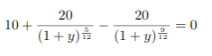

### 公式集

```tex
\usepackage{amsmath}
```

```tex
\begin{gather*}
    Co2Low1(lightIntensity, temperature) \\
    Co2Low2(lightIntensity, temperature)
\end{gather*}
```


## 标签

用`\label`创建标签，用`\ref`引用标签

```tex
\begin{equation}\label{t1}
    10 - \frac{20}{(1+y)^{\frac{5}{12}}} = 0
\end{equation}

代入(\ref{t1})中，得
```

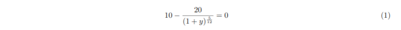
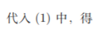

## 插入超链接

<https://blog.csdn.net/qq_34809033/article/details/80734433>

## 插入代码

```tex
\usepackage{listings}
\usepackage{xcolor}
\usepackage{fontspec}
\usepackage{inconsolata}
\fontspec{inconsolata}
\setmonofont[StylisticSet=1]{inconsolata}	%1 or 3??? 让0中间有一个斜线，让l不像1。
```

在`\maketitle`后面设定默认的代码样式。下面是适合黑白打印的设定：

```tex
	\lstset{ %  
		backgroundcolor=\color{white},   % choose the background color; you must add \usepackage{color} or \usepackage{xcolor}  
		basicstyle=\ttfamily,			 %ttfamily is consolas
		breakatwhitespace=false,         % sets if automatic breaks should only happen at whitespace  
		breaklines=true,                 % sets automatic line breaking  
		deletekeywords={...},            % if you want to delete keywords from the given language  
		escapeinside={\%*}{*)},          % if you want to add LaTeX within your code  
		extendedchars=true,              % lets you use non-ASCII characters; for 8-bits encodings only, does not work with UTF-8  
		keepspaces=true,                 % keeps spaces in text, useful for keeping indentation of code (possibly needs columns=flexible)  
		morekeywords={*,...},            % if you want to add more keywords to the set  
		numbers=left,                    % where to put the line-numbers; possible values are (none, left, right)  
		numbersep=5pt,                   % how far the line-numbers are from the code  
		numberstyle=\ttfamily,
		rulecolor=\color{black},         % if not set, the frame-color may be changed on line-breaks within not-black text (e.g. comments (green here))  
		showspaces=false,                % show spaces everywhere adding particular underscores; it overrides 'showstringspaces'  
		showstringspaces=false,          % underline spaces within strings only  
		showtabs=false,                  % show tabs within strings adding particular underscores  
		stepnumber=1,                    % the step between two line-numbers. If it's 1, each line will be numbered  
		tabsize=4,                       % sets default tabsize to 2 spaces  
		columns=fullflexible,
    }
```

### 直接插入代码

```tex
\begin{lstlisting}[numbers=none]
mpirun -n 20 ./xhpl
\end{lstlisting}
```

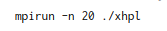

注意代码块里的空格和tab都会如实显示出来。

### 从文本中读取代码

```tex
\lstinputlisting{hello.c}
```

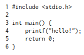
