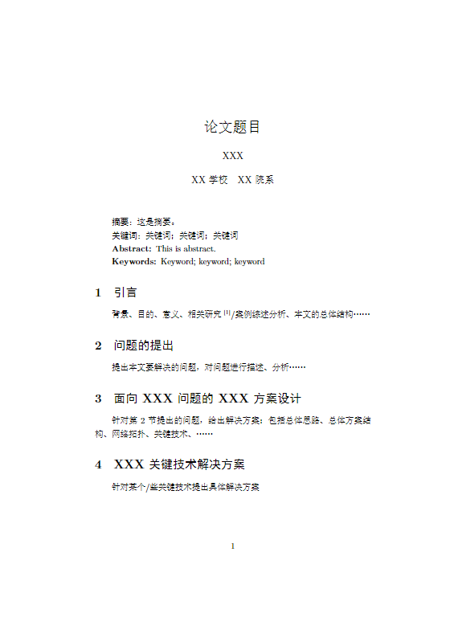
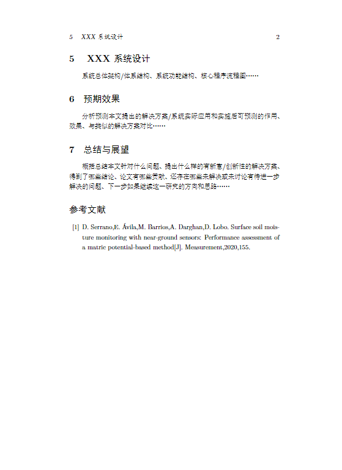

# 参考
[latex 中section的标题左对齐而不是居中](https://blog.csdn.net/u_7890/article/details/82050300)
[作者单位](https://blog.csdn.net/robert_chen1988/article/details/79187224)
[Latex技巧：插入参考文献](https://www.cnblogs.com/yifdu25/p/8330652.html)
[Latex/CTex/WinEdt 将参考文献设为上标引用，并加方括号](https://blog.csdn.net/pang9998/article/details/93849645)

# latex代码
```tex
% !TEX program = xelatex

\documentclass[UTF8]{ctexart}

\usepackage{authblk}
\usepackage{cite}

\CTEXsetup[format={\Large\bfseries}]{section}

\title{论文题目}
\author{XXX}
\affil{XX学校\quad XX院系}
\date{} %不要日期

\begin{document}

\maketitle

\textbf{摘要：}这是摘要。

\textbf{关键词：}关键词；关键词；关键词

\textbf{Abstract: }This is abstract.

\textbf{Keywords: }Keyword; keyword; keyword

\section{引言}
    背景、目的、意义、相关研究\textsuperscript{\cite{土壤湿度传感器}}/案例综述分析、本文的总体结构……

\section{问题的提出}
    提出本文要解决的问题，对问题进行描述、分析……

\section{面向 XXX 问题的XXX方案设计}
    针对第 2 节提出的问题，给出解决方案：包括总体思路、总体方案结构、网络拓扑、关键技术、……

\section{XXX 关键技术解决方案}
    针对某个/些关键技术提出具体解决方案

\section{ XXX 系统设计}
    系统总体架构/体系结构、系统功能结构、核心程序流程图……

\section{预期效果}
    分析预测本文提出的解决方案/系统实际应用和实施后可预测的作用、效果、与类似的解决方案对比……

\section{总结与展望}
    概括总结本文针对什么问题、提出什么样的有新意/创新性的解决方案、得到了哪些结论、论文有哪些贡献、还存在哪些未解决或未讨论有待进一步解决的问题、下一步如果继续这一研究的方向和思路……

\begin{thebibliography}{99}
\bibitem{土壤湿度传感器}D. Serrano,E. Ávila,M. Barrios,A. Darghan,D. Lobo. Surface soil moisture monitoring with near-ground sensors: Performance assessment of a matric potential-based method[J]. Measurement,2020,155.
\end{thebibliography}

\end{document}
```

# 效果


# 提示
- 参考文献的内容可以从知网等地方直接复制过来。
- 报错找不到文献或者序号乱掉时尝试多编译几次。
