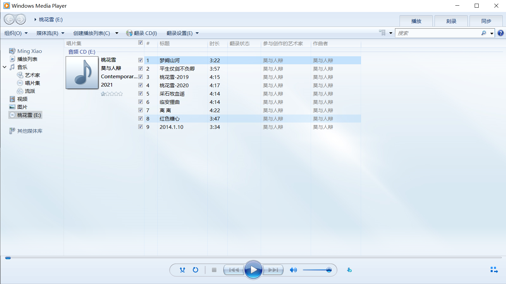
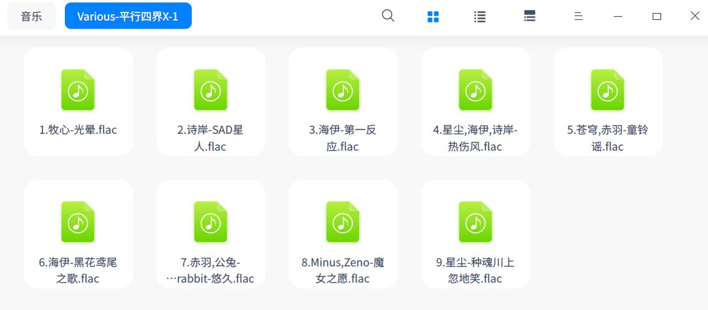
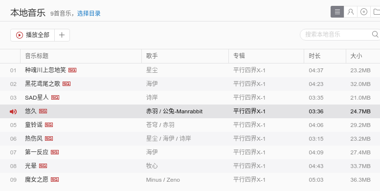

# Windows

在Windows上插入专辑光盘后，打开之后会出现一堆cda文件。右键cda文件，选择用Windows Media Player打开。


或者在开始菜单中选择```windows附件->windows media player```打开，然后就可以看到歌曲列表了。


还可以点击“翻录”把歌曲翻录到mp3。文件输出路径可以通过“翻录设置”指定。

# Linux

Linux下貌似识别不出来cda文件。不过可以这样直接把光盘里的音乐翻录出来：

```shell
sudo apt install abcde flac
abcde -o flac
```

如果不编辑CDDB data的话，导出之后的音乐文件即使是重命名了，导入到音乐软件比如网易云音乐之后，标题和歌手也可能是错误的。所以最好是编辑一下CDDB data，各个域的含义在这里可以看到：

<https://github.com/qyot27/libcddb/blob/master/doc/freedb.howto.txt>

一般只需要输入DTITLE和TTITLExx。

## 单作者专辑

每首歌曲的作者都一样。

DTITLE：```作者 / 专辑名字```
TTITLExx: 第xx首歌曲的标题

```Is the CD multi-artist?```这个问题回答```No```

# 多作者专辑

每首歌曲的作者都不一样。

DTITLE: 专辑名字
TTITLExx: ```作者 / 歌曲名字```，有多个作者的话，就```作者1,作者2 / 歌曲名字```

一个例子：

```
# xmcd CD database file
#
# Track frame offsets:
#	150
#	21424
#	37590
#	56273
#	70903
#	89359
#	109119
#	125356
#	148082
#
# Disc length: 2253 seconds
#
# Submitted via: cddb-tool 0.4.7
#
#blues,classical,country,data,folk,jazz,newage,reggae,rock,soundtrack,misc
#CATEGORY=misc
DISCID=7308c909
DTITLE=平行四界X-1
DYEAR=
DGENRE=
TTITLE0=牧心 / 光晕
TTITLE1=诗岸 / SAD星人
TTITLE2=海伊 / 第一反应
TTITLE3=星尘,海伊,诗岸 / 热伤风
TTITLE4=苍穹,赤羽 / 童铃谣
TTITLE5=海伊 / 黑花鸢尾之歌
TTITLE6=赤羽,公兔-Manrabbit / 悠久
TTITLE7=Minus,Zeno / 魔女之愿
TTITLE8=星尘 / 种魂川上忽地笑
EXTD=
EXTT0=
EXTT1=
EXTT2=
EXTT3=
EXTT4=
EXTT5=
EXTT6=
EXTT7=
EXTT8=
PLAYORDER=
```

```Is the CD multi-artist?```这个问题回答```Yes```

```Which style of multiple artist entries is it?```选择```1) Artist / Title```



## 修改歌曲信息

导出要很久。如果导出后发现填错了，可以用MusicBrainz来编辑歌曲信息（可以给歌曲添加多个作者），不需要重新导出，修改完每首歌之后点击```Save```即可保存修改。

# 参考文献

[怎么将cda转成mp3格式](https://jingyan.baidu.com/article/363872ec0619ef6e4ba16ffd.html)
[linux 翻录cd,Linux下一个CD翻录 创CUE 压缩flac攻略](https://blog.csdn.net/weixin_30967451/article/details/117016176)
<https://linux.die.net/man/1/abcde>
