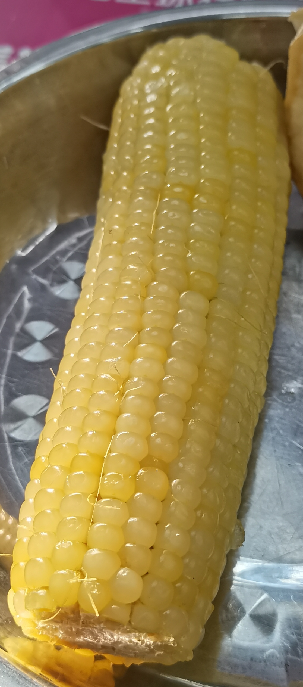
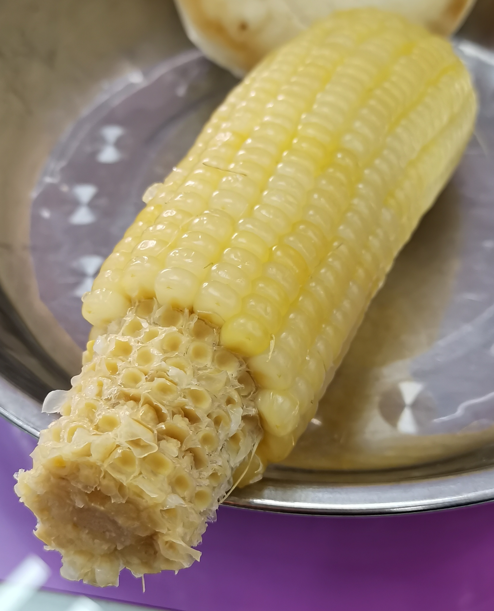
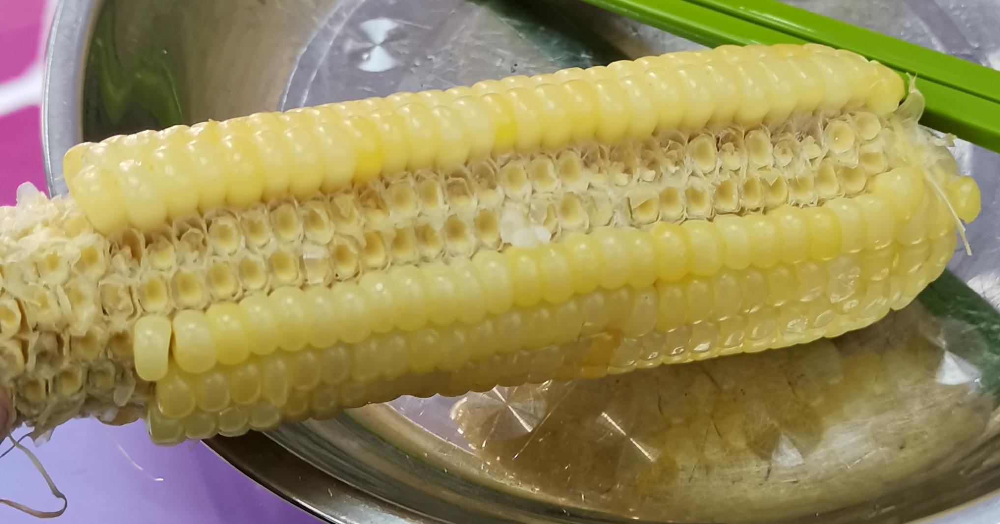
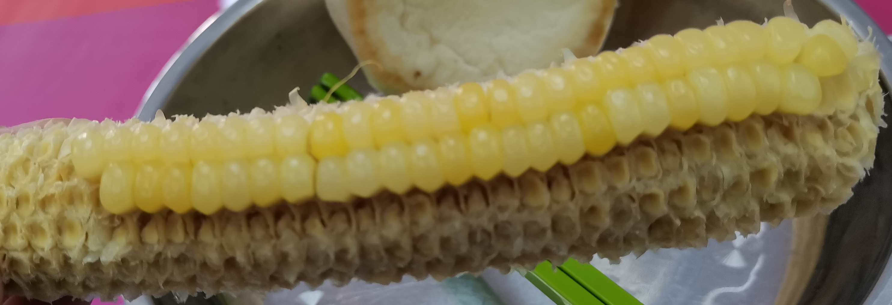
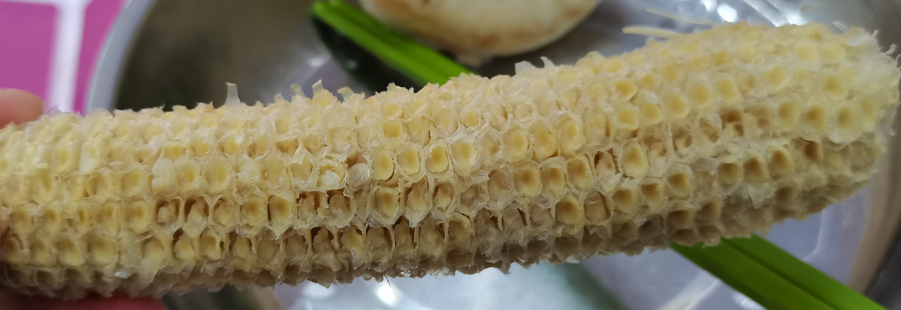

## 一根玉米

## 啃出拿手的地方

## 啃出一排或两排空隙

这一步啃不干净没关系。之后啃完周围的之后再回去啃干净即可。

## 逐排啃

用上门牙或者下门牙逐排把玉米往空隙方向啃下来。具体做法是将门牙垂直插入排之间的缝隙中，然后向空隙方向轻轻用力，玉米粒就会连根拔起了。用下门牙的话注意插入的角度要垂直于圆柱面。

## 啃完啦

## 相关工作

有个人跟我差不多的啃法：

[太难了，这是我见过的啃过的最干净的玉米啦](https://www.bilibili.com/video/av65634199)

英雄所见略同.jpg
