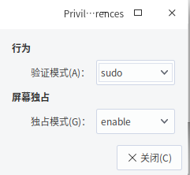

# matlab
先说坑点：Terminal选项一定要为true

打开终端，执行以下命令：
```shell
sudo deepin-editor /usr/share/applications/matlab.desktop
```
然后在里面填入以下内容：（假设你的matlab安装目录为/usr/local/MATLAB/R2019b）
```
[Desktop Entry]
Version=1.0
Name=matlab
Comment=matlab
Exec=/usr/local/MATLAB/R2019b/bin/matlab
Icon=/usr/local/MATLAB/R2019b/bin/glnxa64/cef_resources/matlab_icon.png
Terminal=true
Type=Application
Categories=Development
```
**一定要注意，Terminal选项一定要为true，不然打不开（我也不知道为什么）**
然后保存并退出。
然后在终端中执行
```shell
ln -s /usr/share/applications/matlab.desktop ~/Desktop/matlab.desktop
```
桌面上就会出现matlab的图标

然后双击之即可运行matlab

# wireshark
wireshark默认的启动器是只有用户权限的，只能看抓包结果，一般不能用来抓包。将其改成root权限只需要在原先的启动器的TryExec和Exec后的文件名前加上gksu即可。
gksu可能会出现鉴定故障，解决方法：在终端中输入gksu-properties，然后在弹出的窗口中把验证模式改成sudo。


# 其他坑点
Exec项必须为绝对路径。例如 /home/searchstar/software/a 不能用 ~/software/a 来替换，甚至不能用$HOME/software/a来替换。
