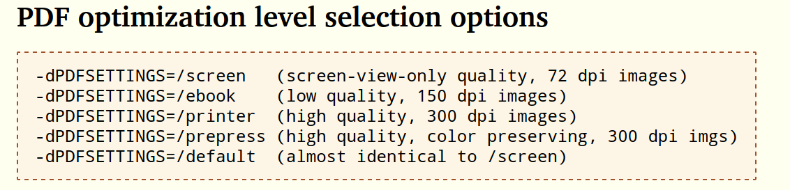

参考：
<https://stackoverflow.com/questions/9625967/changing-pdf-image-dpi-using-gs>
<http://milan.kupcevic.net/ghostscript-ps-pdf/>

```shell
gs -q -dBATCH -dNOPAUSE -sDEVICE=pdfwrite -dPDFSETTINGS=/ebook -sOutputFile=output.pdf  input.pdf
```
各种PDFSETTINGS对应的dpi如下

