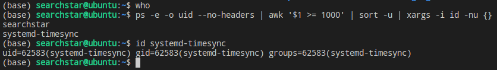

```w```和```who```只能查看哪些人登陆了，但是如果是用vscode登陆的就看不到，只有一个node进程。而且如果有人在后台跑程序也看不到。

所以需要一个可以查看系统中哪些人的进程在跑的命令：
```shell
ps -e -o uid --no-headers | awk '$1 >= 1000' | sort -u | xargs -i id -nu {}
```


这里只显示uid大于等于1000的用户，因为小于1000的不是真实用户。不过看样子uid大于1000的用户也可能不是真实用户，比如上图的```systemd-timesync```。
