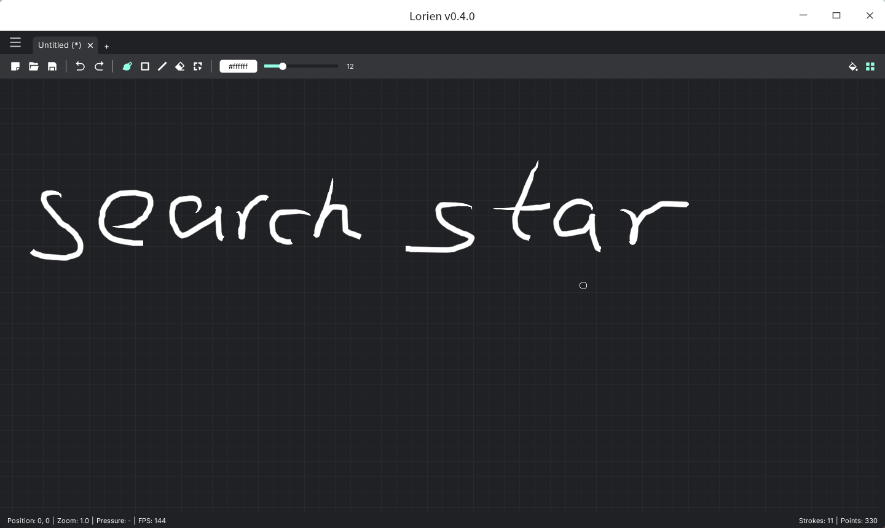

## Lorien

草稿纸无限大，按住鼠标中键拖动，滚动滚轮缩放。

下载地址：<https://github.com/mbrlabs/Lorien/releases>

如果按住鼠标中键不能拖动，请检查是否通过`xmodmap`禁用了鼠标中键。

## mypaint

使用教程：<https://seekstar.github.io/2021/02/04/linux%E8%8D%89%E7%A8%BF%E7%BA%B8%E8%BD%AF%E4%BB%B6mypaint/>

但是这个软件写的东西多了之后会很卡。
