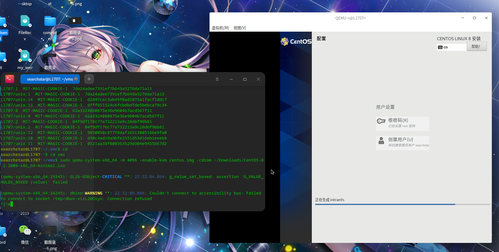
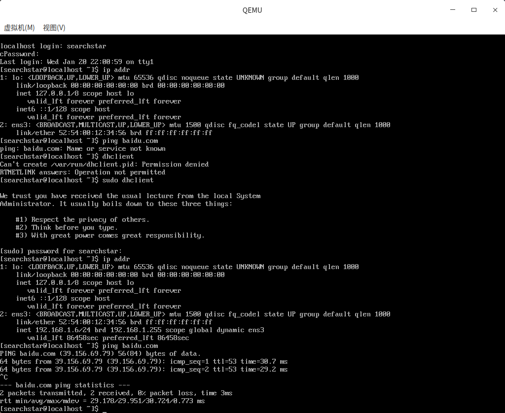
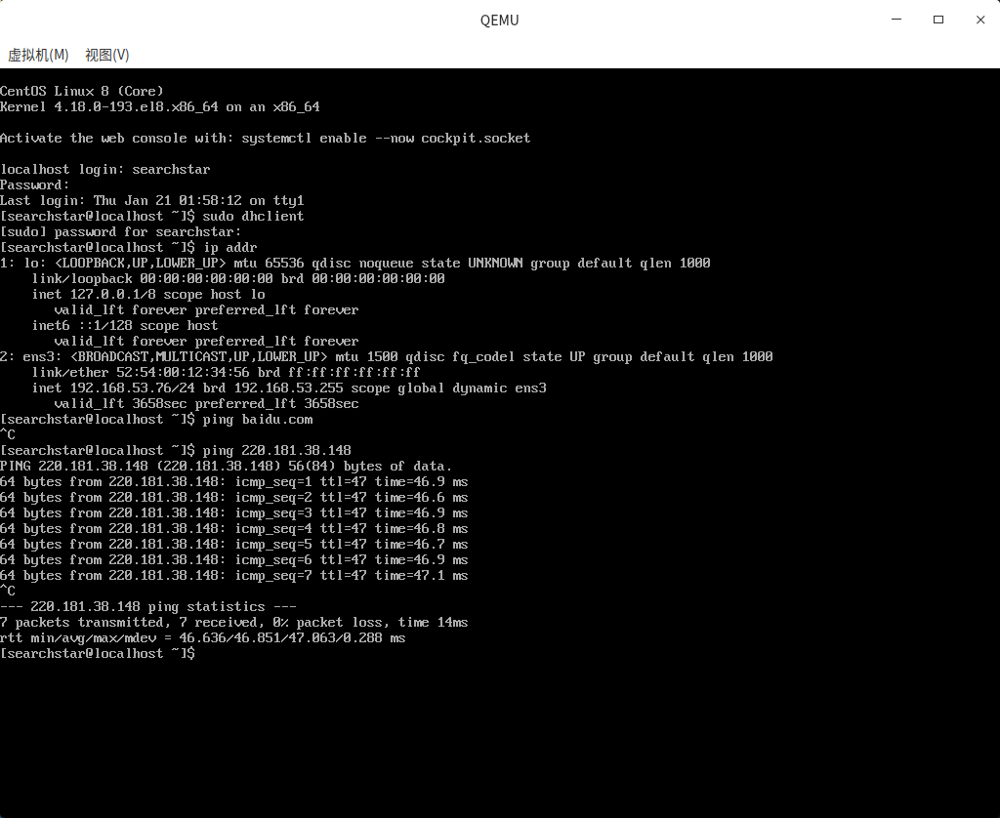

已测试的组合：

- 宿主机：Deepin、Debian 11、centos 8

- 虚拟机：CentOS 8, CentOS Stream 9, Debian 11

## 下载操作系统镜像

可以用中科大的源下载镜像：<http://mirrors.ustc.edu.cn/>
找到要下载的镜像后，右键该链接，点击复制链接，然后到服务器上用wget下载之即可。

## 安装qemu

```shell
# debian系(deepin)
sudo apt install qemu qemu-kvm
# Centos 8 & Centos stream 8
sudo yum install qemu-kvm
```

## 检查KVM是否可用

不开KVM的话性能会很低。

```shell
grep -E 'vmx|svm' /proc/cpuinfo
```

如果有输出则表示硬件有虚拟化支持。其次要检查kvm模块是否已经加载：

```shell
lsmod | grep kvm
```

```text
kvm_intel             315392  0
kvm                   847872  1 kvm_intel
irqbypass              16384  1 kvm
```

如果kvm_intel/kvm_amd、kvm模块被显示出来，则kvm模块已经加载。

如果少了模块，比如`kvm_intel`，那就

```shell
modprobe kvm-intel
```

如果输出

```text
modprobe: ERROR: could not insert 'kvm_intel': Operation not supported
```

就看一下dmesg里有没有错误信息：

```shell
dmesg | less
```

按G翻到最后，如果有

```text
kvm: disabled by bios
```

说明要去BIOS里开启一下KVM的支持。

## 启动虚拟机安装操作系统

### 命令行安装

```shell
# Centos stream 8
sudo yum install libvirt virt-install
# Ubuntu 20.04, deepin 20
sudo apt install virtinst
# Debian 11
sudo apt install virtinst libvirt-daemon-system
sudo virsh net-start default
```

然后让普通用户使用libvirt时能使用KVM：

然后就可以开始安装了：

```shell
virt-install --name=centos8 --memory=1024 --vcpus=4 --os-type=linux --os-variant=rhel8.4 --location=/home/searchstar/Downloads/CentOS-8.4.2105-x86_64-dvd1.iso --disk path=centos.img,size=100 --graphics=none --console=pty,target_type=serial --extra-args="console=tty0 console=ttyS0"
```

os-variant不填也可以。其取值范围可以通过`osinfo-query os`查看，`osinfo-query`在`libosinfo-bin`包中。

注意虚拟机deepin不支持命令行安装，会报错：

```text
ERROR    验证安装位置出错：Could not find an installable distribution at 'deepin-desktop-community-20.2.2-amd64.iso'
The location must be the root directory of an install tree.
```

安装界面：

```text
Installation

1) [x] Language settings                 2) [x] Time settings
       (English (United States))                (America/New_York timezone)
3) [!] Installation source               4) [!] Software selection
       (Processing...)                          (Processing...)
5) [!] Installation Destination          6) [x] Kdumpch tab: Alt+Tab | Help: F1 
       (Processing...)                          (Kdump is enabled)
7) [!] Network configuration             8) [!] Root password
       (Not connected)                          (Root account is disabled.)
9) [!] User creation
       (No user will be created)
Please make a selection from the above ['b' to begin installation, 'q' to quit,
'r' to refresh]:
```

要把带`[!]`的都处理完。不过下面写了`(Processing...)`的可以按`r`刷新，等它出结果。
安装好了之后会自动重启，然后就可以登录了。

### 使用vnc安装

#### 创建虚拟机磁盘文件

不使用virt-install的话，要手动创建虚拟机的磁盘文件。

```shell
qemu-img create -f qcow2 centos.img 256G
```

```text
Formatting 'centos.img', fmt=qcow2 size=274877906944 cluster_size=65536 lazy_refcounts=off refcount_bits=16
```

`-f`后面跟虚拟机镜像格式，支持的有：
raw: 默认格式。裸的磁盘文件。
[qcow2](https://blog.csdn.net/bemind1/article/details/99678172): 最常用。支持稀疏文件、快照等。
其他：qemu还兼容其他的格式，比如VMDK, VDI, VHD(vpc), VHDX, qcow1 and QED。

这些可以通过`man qemu-img`查到。

#### debian系

```shell
# vnc=:2 可以换成其他可用端口。
sudo qemu-system-x86_64 -m 4096 -enable-kvm centos.img -cdrom ~/Downloads/CentOS-8.2.2004-x86_64-minimal.iso -display vnc=:2
```

然后就会在`5902`端口（也可以换成其他可用端口）开一个vnc server。用这里的方法连上即可：

#### Centos 8

Centos 8比较特殊:

```shell
sudo /usr/libexec/qemu-kvm -m 4096 -enable-kvm centos.img -cdrom ~/Downloads/CentOS-8.2.2004-x86_64-minimal.iso
```

```text
VNC server running on ::1:5900
```

用这里的方法连上即可：


`ctrl+alt+g`可以取消捕获。

## 联网

虚拟机一开始是没有网络的。

### virsh



### 桥接网卡（有概率失败）

```shell
sudo apt install bridge-utils uml-utilities
```

先看自己的机器的网卡编号

```shell
ip addr
```

```text
1: lo: <LOOPBACK,UP,LOWER_UP> mtu 65536 qdisc noqueue state UNKNOWN group default qlen 1000
    link/loopback 00:00:00:00:00:00 brd 00:00:00:00:00:00
    inet 127.0.0.1/8 scope host lo
       valid_lft forever preferred_lft forever
    inet6 ::1/128 scope host 
       valid_lft forever preferred_lft forever
2: eno1: <BROADCAST,MULTICAST,UP,LOWER_UP> mtu 1500 qdisc pfifo_fast state UP group default qlen 1000
    link/ether 30:9c:23:f0:33:40 brd ff:ff:ff:ff:ff:ff
    inet 10.249.41.236/21 brd 10.249.47.255 scope global dynamic noprefixroute eno1
       valid_lft 40668sec preferred_lft 40668sec
    inet6 fe80::140d:db62:feb5:b904/64 scope link noprefixroute 
       valid_lft forever preferred_lft forever
```

可以看到我的编号是`eno1`。
由于操作网卡有可能导致连不上网，而连不上网的话服务器就失控了，所以最好是先设置一个定时重启，完成配置之后检测一下有没有网，有网则取消重启，否则就立即重启。由于操作过程有一段时间连不上网，所以需要把下面的保存为`net.sh`：

```shell
set -e
if [ ! $1 ]; then
    echo Usage: $0 net_dev
    exit
fi
shutdown -r 1

brctl addbr br0
brctl addif br0 $1
# 这个时候会断网
ifconfig br0 0.0.0.0 promisc up
ifconfig $1 0.0.0.0 promisc up
dhclient br0
#brctl show br0
#brctl showstp br0

tunctl -t tap0 -u root              # 创建一个tap0接口，只允许root用户访问
brctl addif br0 tap0                # 在虚拟网桥中增加一个tap0接口
ifconfig tap0 0.0.0.0 promisc up    # 打开tap0接口
#brctl showstp br0                   # 显示br0的各个接口

if ping -c 1 baidu.com; then
    shutdown -c
    echo Shutdown canceled.
else
    shutdown -r now
fi
```

`promisc`: 混杂模式（promiscuous mode）是电脑网络中的术语。是指一台机器的网卡能够接收所有经过它的数据流，而不论其目的地址是否是它。

然后运行脚本

```shell
sudo bash net.sh eno1
```

奇怪的是，在我的服务器上第一次失败了，但是重启之后第二次就成功了。

然后用下面的命令重新启动虚拟机：

```shell
sudo qemu-system-x86_64 -m 4096 -enable-kvm centos.img -net nic -net tap,ifname=tap0,script=no,downscript=no
```

如果虚拟机是centos的话，还需要在虚拟机中执行一下

```shell
dhclient
```

才能拿到ip。

这个相当于把虚拟机桥接到外面去了。如果外面的网络要登陆才能上网的话，还需要登陆一下。


### NAT（有概率失败）

如果装的虚拟机没有GUI，但是外面的网络又需要在网页上登陆才能使用，那桥接就不太可行了，这时要用NAT模式，使虚拟机直接使用主机的网络。

<https://wiki.qemu.org/Documentation/Networking/NAT>
把下面的保存为`ifup_nat.sh`

```shell
#!/bin/sh
#
# Copyright IBM, Corp. 2010  
#
# Authors:
#  Anthony Liguori <aliguori@us.ibm.com>
#
# This work is licensed under the terms of the GNU GPL, version 2.  See
# the COPYING file in the top-level directory.

# Set to the name of your bridge
BRIDGE=br0

# Network information
NETWORK=192.168.53.0
NETMASK=255.255.255.0
GATEWAY=192.168.53.1
DHCPRANGE=192.168.53.2,192.168.53.254

# Optionally parameters to enable PXE support
TFTPROOT=
BOOTP=

do_brctl() {
    brctl "$@"
}

do_ifconfig() {
    ifconfig "$@"
}

do_dd() {
    dd "$@"
}

do_iptables_restore() {
    iptables-restore "$@"
}

do_dnsmasq() {
    dnsmasq "$@"
}

check_bridge() {
    if do_brctl show | grep "^$1" > /dev/null 2> /dev/null; then
	return 1
    else
	return 0
    fi
}

create_bridge() {
    do_brctl addbr "$1"
    do_brctl stp "$1" off
    do_brctl setfd "$1" 0
    do_ifconfig "$1" "$GATEWAY" netmask "$NETMASK" up
}

enable_ip_forward() {
    echo 1 | do_dd of=/proc/sys/net/ipv4/ip_forward > /dev/null
}

add_filter_rules() {
do_iptables_restore <<EOF
# Generated by iptables-save v1.3.6 on Fri Aug 24 15:20:25 2007
*nat
:PREROUTING ACCEPT [61:9671]
:POSTROUTING ACCEPT [121:7499]
:OUTPUT ACCEPT [132:8691]
-A POSTROUTING -s $NETWORK/$NETMASK -j MASQUERADE 
COMMIT
# Completed on Fri Aug 24 15:20:25 2007
# Generated by iptables-save v1.3.6 on Fri Aug 24 15:20:25 2007
*filter
:INPUT ACCEPT [1453:976046]
:FORWARD ACCEPT [0:0]
:OUTPUT ACCEPT [1605:194911]
-A INPUT -i $BRIDGE -p tcp -m tcp --dport 67 -j ACCEPT 
-A INPUT -i $BRIDGE -p udp -m udp --dport 67 -j ACCEPT 
-A INPUT -i $BRIDGE -p tcp -m tcp --dport 53 -j ACCEPT 
-A INPUT -i $BRIDGE -p udp -m udp --dport 53 -j ACCEPT 
-A FORWARD -i $1 -o $1 -j ACCEPT 
-A FORWARD -s $NETWORK/$NETMASK -i $BRIDGE -j ACCEPT 
-A FORWARD -d $NETWORK/$NETMASK -o $BRIDGE -m state --state RELATED,ESTABLISHED -j ACCEPT 
-A FORWARD -o $BRIDGE -j REJECT --reject-with icmp-port-unreachable 
-A FORWARD -i $BRIDGE -j REJECT --reject-with icmp-port-unreachable 
COMMIT
# Completed on Fri Aug 24 15:20:25 2007
EOF
}

start_dnsmasq() {
    do_dnsmasq \
	--strict-order \
	--except-interface=lo \
	--interface=$BRIDGE \
	--listen-address=$GATEWAY \
	--bind-interfaces \
	--dhcp-range=$DHCPRANGE \
	--conf-file="" \
	--pid-file=/var/run/qemu-dnsmasq-$BRIDGE.pid \
	--dhcp-leasefile=/var/run/qemu-dnsmasq-$BRIDGE.leases \
	--dhcp-no-override \
	${TFTPROOT:+"--enable-tftp"} \
	${TFTPROOT:+"--tftp-root=$TFTPROOT"} \
	${BOOTP:+"--dhcp-boot=$BOOTP"}
}

setup_bridge_nat() {
    if check_bridge "$1" ; then
	create_bridge "$1"
	enable_ip_forward
	add_filter_rules "$1"
	start_dnsmasq "$1"
    fi
}

setup_bridge_vlan() {
    if check_bridge "$1" ; then
	create_bridge "$1"
	start_dnsmasq "$1"
    fi
}

setup_bridge_nat "$BRIDGE"

if test "$1" ; then
    do_ifconfig "$1" 0.0.0.0 up
    do_brctl addif "$BRIDGE" "$1"
fi
```

并给执行权限：

```shell
chmod +x ifup_nat.sh
```

如果不给执行权限会报错(exit code 255)。

然后启动虚拟机：

```shell
sudo qemu-system-x86_64 -m 4096 -enable-kvm centos.img -net nic -net tap,script=ifup_nat.sh
```


这个方法我在家里的电脑上实验成功，但是在学校的服务器上失败了，不知道为什么。

## 其他

### nographic启动



### 嵌套虚拟化

就是虚拟机里套虚拟机：
参数里添加

```text
-enable-kvm -cpu host
```

把所有宿主机CPU的特性都传下去。详情可见：

```shell
/usr/libexec/qemu-kvm -cpu help
```

参考：<https://www.cnblogs.com/jython/p/4458807.html>
注：如果只放`-enable-kvm -cpu qemu64,+vmx`，我这`lsmod`里就没有`kvm_intel`。

### centos开机自动联网

<https://blog.csdn.net/u012972536/article/details/79827292>

### UEFI启动

Debian 11：加上`-bios /usr/share/ovmf/OVMF.fd`即可。

启动之后，发现`/sys/firmware/efi`目录存在，说明确实是UEFI启动的。

参考：[linux怎么查看操作系统是uefi启动还是bios启动？](https://blog.csdn.net/weixin_50698817/article/details/123530442)

### ttyS0登录时输入用户名后卡住

这个在deepin虚拟机里更换内核之后碰到过。解决方案：



### network disk service卡住

centos虚拟机中出现过，要好几分钟才能进去，而且最终这几个服务会启动失败：

```text
[FAILED] Failed to start System Security Services Daemon.
[FAILED] Failed to start Disk Manager.
[FAILED] Failed to start OpenSSH server daemon.
[FAILED] Failed to start GSSAPI Proxy Daemon.
[FAILED] Failed to start Crash recovery kernel arming.
```

其实原因和解决方案都跟上一个一样，都是这个：



## 参考文献

[QEMU 1: 使用QEMU创建虚拟机](https://my.oschina.net/kelvinxupt/blog/265108) 其中软件安装的部分不全，要装`qemu-kvm`
[Can't find tool qemu-system-x86](https://bugzilla.redhat.com/show_bug.cgi?id=1715806)
[qemu虚拟机与外部网络的通信](https://blog.csdn.net/u014022631/article/details/53411557)
[kvm 命令行安装虚拟机方法](https://jingyan.baidu.com/article/c910274bdcee218c371d2d36.html)
[KVM 使用 virt-install 创建虚拟机失败经历](https://blog.csdn.net/sdulibh/article/details/51657260)
<https://askubuntu.com/questions/1225216/failed-to-connect-socket-to-var-run-libvirt-libvirt-sock>
<https://www.xmodulo.com/network-default-is-not-active.html>
