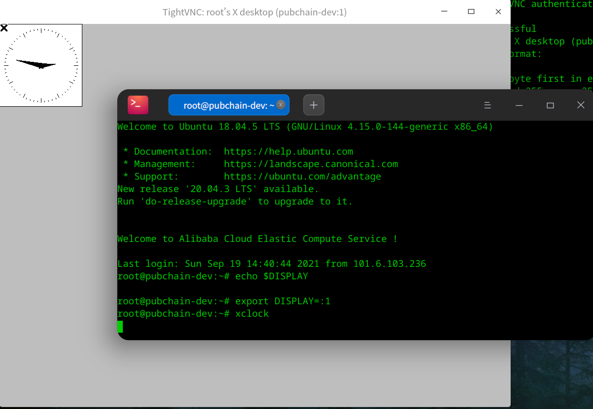

在deepin、ubuntu、Centos 8上测试通过。

## 约定

sshname表示在`.ssh/config`里的名字，可以是IP地址。
注：测试用的服务器的sshname都为L1707

## 服务器

debian系:

```shell
sudo apt install tightvncserver
```

Centos 8:

```shell
sudo yum install tigervnc-server.x86_64
```

```shell
vncserver
```

```text
searchstar@L1707:~$  vncserver

You will require a password to access your desktops.

Password: 
Warning: password truncated to the length of 8.
Verify:   
Would you like to enter a view-only password (y/n)? n

New 'X' desktop is L1707:1

Creating default startup script /home/searchstar/.vnc/xstartup
Starting applications specified in /home/searchstar/.vnc/xstartup
Log file is /home/searchstar/.vnc/L1707:1.log
```

## 客户端

先构建ssh隧道，其语法如下

```shell
ssh -g -L xxxx:ip:5901 sshname
```

```text
-L port:host:hostport
        将本地机(客户机)的某个端口转发到远端指定机器的指定端口.  工作原理是这样的,
        本地机器上分配了一个 socket 侦听 port 端口, 一旦这个端口上有了连接, 该连接
        就经过安全通道转发出去, 同时远程主机和 host 的 hostport 端口建立连接. 可以
        在配置文件中指定端口的转发. 只有 root 才能转发特权端口.  IPv6 地址用另一种
        格式说明: port/host/hostport
```

对于我们的情况，命令这样写：

```shell
ssh -g -L 5901:localhost:5901 sshname
```

这样就把服务器自己的5901端口映射到本地的5901端口了。

然后保持这个shell不动，另开一个shell，打开vncviewer:

```shell
sudo apt install xtightvncviewer
vncviewer localhost:1
```


就是任务栏没了。。。

如果需要在终端中执行GUI程序，先查看`DISPLAY`环境变量是否已经设置了：

```shell
echo $DISPLAY
```

如果输出不为空，就可以直接在终端中执行GUI命令了：

如果输出为空说明没有设置，可以手动设置一下：

```shell
export DISPLAY=:1
```

然后执行GUI命令后窗口就会显示在之前打开的桌面上。

```shell
xclock
```



## 关闭vncserver

```shell
vncserver -kill :1
```

## 参考文献

<http://www.zsythink.net/archives/2450>

<https://blog.csdn.net/cuma2369/article/details/107668471>
