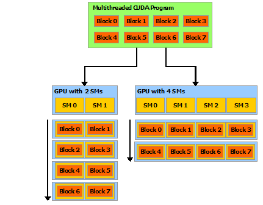

# GPU结构概览
参考：<https://blog.csdn.net/fengtian12345/article/details/80546799>
硬件上，GPU由多个SM(Steaming Multiprocessor)构成，SM有多个warp，warp有多个SP(streaming processor)，一个SP对应一个线程。
一个warp中的SP执行相同的指令。

软件上，一个kernel(就是核函数的kernel)对应一个grid，一个grid有多个block，一个block有多个thread。
block是加载到SM上运行的。

图片来源：<https://docs.nvidia.com/cuda/cuda-c-programming-guide/index.html>

block内部可以使用SM提供的shared memory和__syncthreads()功能实现线程同步和通信。但是block之间除了结束kernel之外是无法同步的。

# 一个warp中的线程执行同一分支
由于一个warp中的SP执行相同的指令，所以如果代码中有分支，而一个warp中一部分线程执行一个分支，一部分线程执行另一个分支，则会造成一些线程停滞。所以要尽量保证一个warp内的线程都执行同一个分支。

# 一个block中的线程操作的内存地址应当临近
由于block是放到一个SM中执行的，而一个SM中的所有SP都共享一个L1 cache，所以如果一个block中的线程操作的内存地址相距很远，那么一些cache line被load到L1 cache后没有怎么被用到就被其他线程load进来的cache line挤出去了，那就会造成严重的读写放大，严重影响效率。
