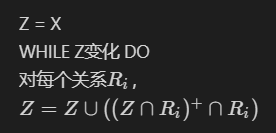

## 矩阵

参考：<https://www.jianshu.com/p/08cbe54a5f33>
$$
\left[
	\begin{matrix}
		1 & 2 \\
		3 & 4
	\end{matrix}
\right]
$$

```markdown
$$
\left[
	\begin{matrix}
		1 & 2 \\
		3 & 4
	\end{matrix}
\right]
$$
```

## 表格

| name1 | name2 | name3 |
| ---- | ---- | ---- |
| a | b | c |
| d | e | f |

```markdown
| name1 | name2 | name3 |
| ---- | ---- | ---- |
| a | b | c |
| d | e | f |
```

## 多行公式对齐

参考：<https://zhidao.baidu.com/question/500652228447668004.html>

跟latex的语法差不多，只是要用一对`$$`包起来。

```markdown
$$
\begin{aligned}
G &= \{A_1 \rightarrow (A_2, A_3); A_3 \rightarrow A_4\} \cup \{(A_2, A_3) \rightarrow (A_5, A_6); A_5 \rightarrow A_2\} \\
&= \{A_1 \rightarrow (A_2, A_3); A_3 \rightarrow A_4; (A_2, A_3) \rightarrow (A_5, A_6); A_5 \rightarrow A_2\}
\end{aligned}
$$
```

$$
\begin{aligned}
G &= \{A_1 \rightarrow (A_2, A_3); A_3 \rightarrow A_4\} \cup \{(A_2, A_3) \rightarrow (A_5, A_6); A_5 \rightarrow A_2\} \\
&= \{A_1 \rightarrow (A_2, A_3); A_3 \rightarrow A_4; (A_2, A_3) \rightarrow (A_5, A_6); A_5 \rightarrow A_2\}
\end{aligned}
$$

## 公式编号及引用

要装一个插件：`pandoc-crossref`:

```shell
pandoc file.md --filter pandoc-crossref -o file.pdf
```

<https://tex.stackexchange.com/questions/111868/pandoc-how-can-i-get-numbered-latex-equations-to-show-up-in-both-pdf-and-html-o>

感觉这个方法通用性不是很好。

## 换行

参考：<https://www.jianshu.com/p/763e5b531d8f>

### 单行

```markdown
Z = X <br/>
WHILE Z变化 DO <br/>
对每个关系$R_i$，<br/>
$Z = Z\cup ((Z\cap R_i)^+ \cap R_i)$ <br/>
```

在vscode中



但是在csdn中是这样：

Z = X <br/>
WHILE Z变化 DO <br/>
对每个关系$R_i$，<br/>
$Z = Z\cup ((Z\cap R_i)^+ \cap R_i)$ <br/>

这是因为csdn为了用户体验，把原本的回车也显示出来了。

### 多行

```markdown
a<br/><br/><br/>b
```

a<br/><br/><br/>b

## 打印反引号

用比要打印的反引号的个数多一个的反引号把它包起来就好了。

比如要打一个反引号：``` `` ` `` ```，效果：`` ` ``。

两个反引号：```` ``` `` ``` ````，效果：``` `` ```。

参考：

<https://www.jianshu.com/p/d6ca2d4dfaab>

<https://www.v2ex.com/t/57233>
