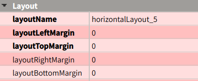

# 小知识
- 只能在主线程操作GUI
- QObject析构时会disconnect所有已连接的信号槽，所以信号不会激活已析构的槽函数，也就不会导致错误
<https://www.zhihu.com/question/267091656>

# 非模态窗口的内存释放
使用setAttribute(Qt::WA_DeleteOnClose)。其中WA是```Window Attribute```
```cpp
HelpWindow *w = new HelpWindow;
w->setAttribute(Qt::WA_DeleteOnClose);
w->show();
```

# layout太小导致部件拖不进去
把margin改大一点，拖进去之后再改回来。


# QString和std::string的相互转化
参考：<https://www.cnblogs.com/Braveliu/p/9844427.html>
QString -> std::string
```cpp
QString.toStdString()
```
std::string -> QString
```cpp
QString(std::string.c_str())
```

# pro中添加头文件和源文件
参考：<https://bbs.csdn.net/topics/390499545?page=1>
```
HEADERS += your/dir1/*.h \
   your/dir2/*.hpp

SOURCES += your/dir1/*.cpp \
   your/dir2/*.c
```
