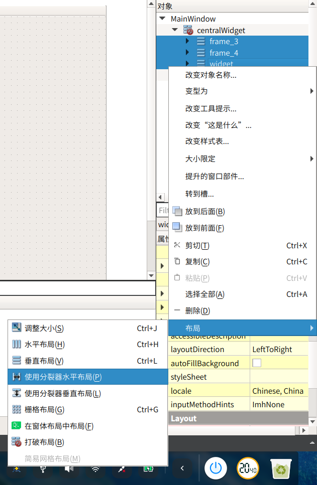
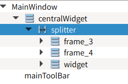

# 固定比例
参考：<https://blog.csdn.net/qq_25800311/article/details/80899242>
将要按比例布局的部件放到layout里（或者设置父部件的layout方式）（horizontal layout或者vertical layout），然后使用layoutStretch调节比例。

# 设置默认比例，用户可调节
详细：<https://www.cnblogs.com/qiaozhoulin/p/4528002.html>

- 把要进行布局的几个组件的上层组件打破布局
- 按住ctrl，选中要进行布局的几个组件，右键，选择布局，然后选择“使用分裂器水平布局”或“使用分裂器竖直布局”

- 生成了一个splitter对象，它把这几个组件都包含进去了，如图

这时编译，把鼠标放到这几个组件中的相邻两个组件的分界线上拖动就可以调节大小了
- 选中某个组件，在sizePolicy中设置水平伸展（或竖直伸展）的值。这几个组件的伸展值的比例就是默认比例。
