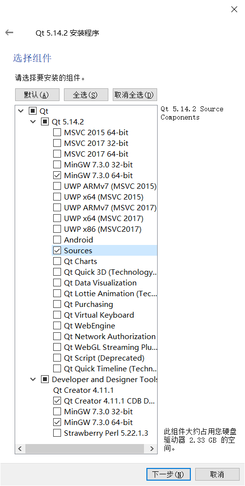
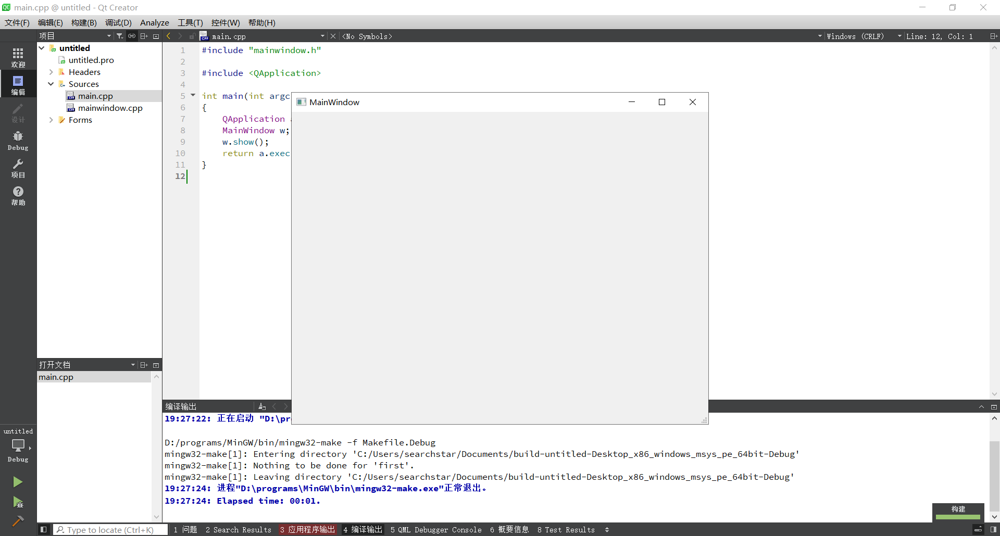

## linux

```shell
sudo apt install -y qtcreator valgrind
```

其中valgrind是用来检测内存泄漏的工具。

## windows

### 下载qt5离线安装包

<https://mirrors.tuna.tsinghua.edu.cn/qt/official_releases/qt/>
挑一个版本下载

### 选择组件

根据自己的需求选。
组件介绍：<https://www.cnblogs.com/lixuejian/p/10903088.html>
我的选择：



#### Qt 5.14.2

- MinGW 7.3.0 64-bit
Qt 5.14.2 Prebuilt Components for MinGW 7.3.0 64-bit
- Sources
Qt 5.14.2 Source Components。
据说有些应用跟QT对接需要编译QT源码：<https://blog.csdn.net/u014491932/article/details/87909356>

#### Developer and Designer Tools

- Qt creator 4.11.1 CDB Debugger Support
- MinGW 7.3.0 64bit
MinGW-builds 7.3.0 64-bit toolchain.
这个跟上面的不一样，这个是工具链。

### 测试

新建一个项目，直接ctrl+r跑一下



成功
