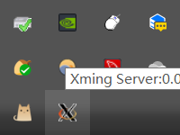
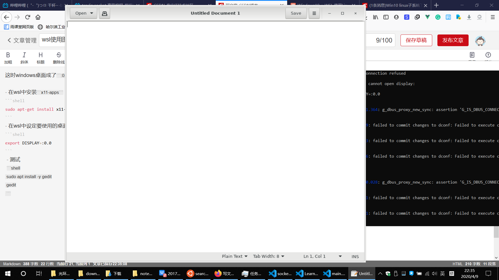
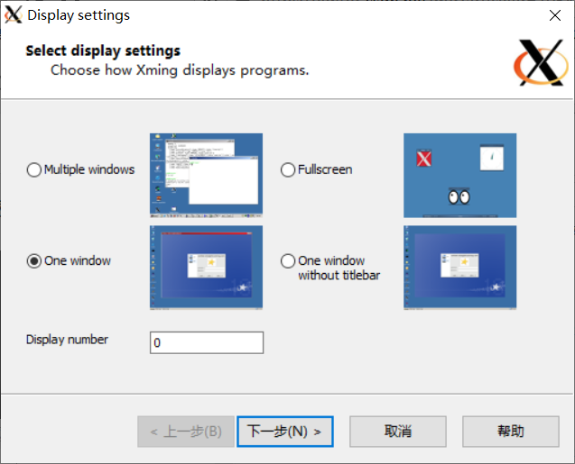
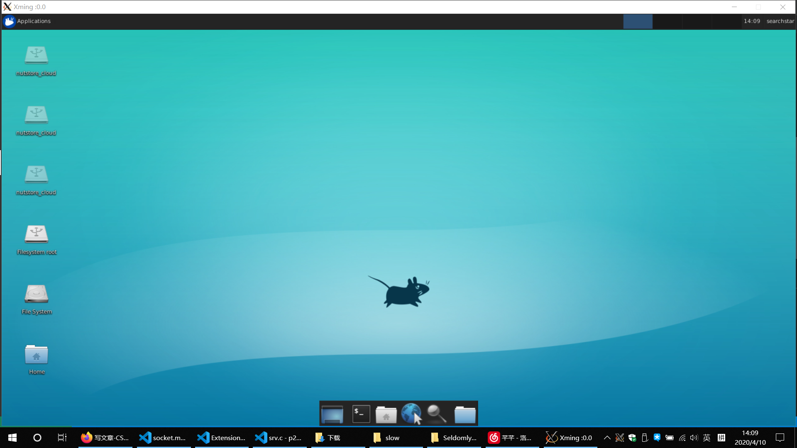

# 使用windows桌面
参考：<https://blog.csdn.net/u010525694/article/details/80096187>

- 下载并安装windows版本[Xming](https://sourceforge.net/projects/xming/?source=typ_redirect)



这时windows桌面成了`:0.0`号桌面

- 在wsl中安装`x11-apps`
```shell
sudo apt-get install x11-apps
```
- 在wsl中设定要使用的桌面

```shell
export DISPLAY=:0.0
```

 - 测试

```shell
sudo apt install -y gedit
gedit
```



成功在windows桌面打开。

但是不能输入中文。

# 使用xfce
参考：<https://www.jianshu.com/p/8404e34feefe>

先执行上面的使用windows桌面的操作，然后执行下面的步骤。

- 安装桌面
```shell
sudo apt-get install xfce4-terminal
sudo apt-get install xfce4
```

- 设置显示设置
```shell
export DISPLAY=:0.0
export LIBGL_ALWAYS_INDIRECT=1
```

- windows上打开XLaunch
使用One Window



- 启动桌面
```shell
startxfce4
```



但是还是无法输入中文。
