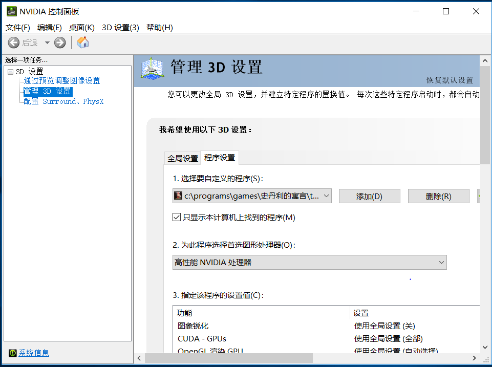
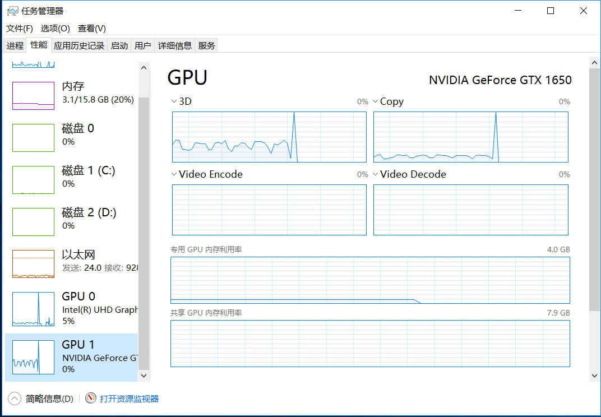

首先要下载独显驱动。
<https://www.nvidia.cn/Download/index.aspx?lang=cn>
这时任务管理器里就可以看到独显占用率了。
然后桌面右键打开`nvidia控制面板`，把要使用独显的游戏设置为使用独显（如果默认不使用独显的话）

如果还不行，可能是还需要装上CPU的核显驱动（很奇怪吧？我也觉得）
intel核显驱动下载：
<https://downloadcenter.intel.com/download/29904/Intel-Graphics-Windows-10-DCH-Drivers?product=80939>
（这个网址是用<https://cn.bing.com/>搜到的，百度搜到的都是下载站。。。）
装上之后在任务管理器可以看到核显和独显的占用。
然后游戏就神奇地可以用独显了。

