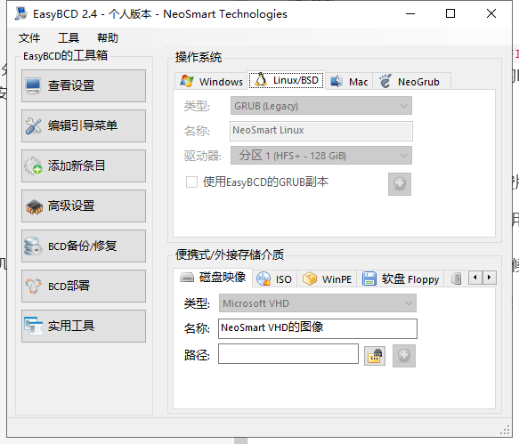

强烈谴责windows的霸道行径！！！

首先安装windows时提示`检测到EFI分区为NTFS格式，请格式化为FAT32后重试`。但是所有的EFI分区都是FAT32的。然后我尝试着把之前安装Linux时设置的EFI分区删了，使用windows安装程序自己生成的EFI分区，然后就安装成功了，但是Linux就进不去了。

## 方法一：再安装一个Linux

再弄出一片空闲空间，安装一个Linux发行版，比如ubuntu，安装的时候新建一个EFI分区。装完之后所有系统都可以进去了。

## 方法二：重新安装grub

先利用启动盘等方式进入live操作系统，然后利用`lsblk`等方式找到你想用来提供grub界面的linux发行版的分区，假设是`/dev/A`。然后把这个分区挂载到`/mnt`：

```shell
mount /dev/A /mnt
cd /mnt
```

然后把`/mnt/dev`, `/mnt/proc`, `/mnt/sys`, `/mnt/run`都挂上：

然后把EFI分区挂到`mnt/boot/efi`（其实在chroot里mount也可以）：

```shell
mount /dev/EFI分区 /mnt/boot/efi
```

然后生成grub配置：

```shell
update-grub
```

然后安装grub到EFI分区所在的磁盘：

```shell
grub-install /dev/EFI分区所在的磁盘
```

然后检查`/etc/fstab`里的`/boot/efi`所在的行，如果使用的是UUID，那么可能需要改成`/dev/EFI分区`，因为UUID可能会改变，导致之后进不去系统。

然后重启之后应该就可以看到正常的GRUB界面，Linux和Windows系统也应该都能进去了。

P.S. 不知道为什么，chroot到deepin的分区之后重启看不到GRUB界面，但是chroot到debian的分区之后重启就能看到GRUB界面。

参考：<https://unix.stackexchange.com/questions/96977/grub-probe-error-failed-to-get-canonical-path-of-cow#96981>

## 失败的尝试

首先尝试了EasyBCD，选择免费版安装即可。但是添加新条目中Linux/BSD没法选驱动器（灰色的）。


然后烧了个ubuntu启动盘，在试用模式下使用`boot-repair`，虽然提示修复成功了，但是开机后直接进入了grub命令行。
