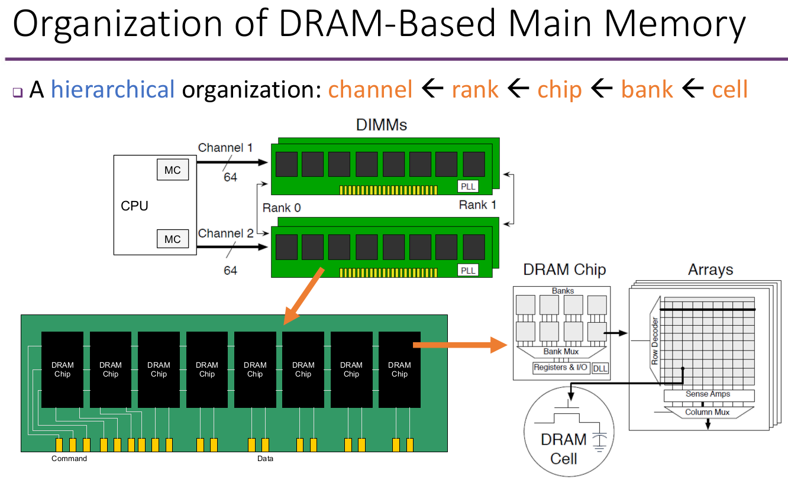
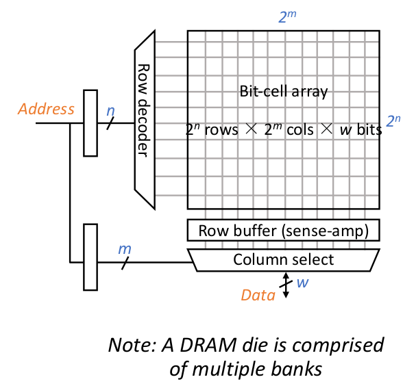
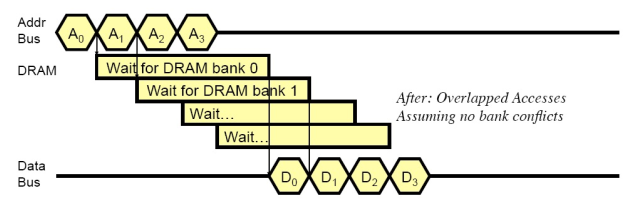

本文的所有图片的来源都是gmy老师的PPT。

DRAM层级结构示意图：

首先我们看一下Bank内的结构：

有五个基本命令：

ACTIVATE: 打开一个row。由于DRAM是用电容来保存信息的，所以打开一个row就意味着这些电容里的电荷被释放掉了。因此需要用row buffer将这些信息暂时保存住。

READ: 将row buffer里的某些数据读出来。

WRITE: 将某些数据写入row buffer

PRECHARGE: 将row buffer里的东西写回。也就是说，这个row被关闭了。

REFRESH: 由于电容会漏电，所以需要周期性把内容读出来再重新写回去，这个操作就是refresh。

chip就是内存颗粒。内存颗粒过大的话，会导致良品率过低，所以为了增大容量，一个Rank上会分成很多个chip。PCB板上走线越少越好，所以将数据位平均分配给这些chip，比如假如数据总线长度是64bit，然后一个rank上有8个chip，那就每个chip分8位。这些chip共用command line和address line。这样，每个chip的引脚数就少了，有利于降低芯片封装的成本。

那么，为什么chip内部还要分成多个bank，而不是干脆做成一个大bank呢？我觉得主要是因为多个bank的内存访问是独立的，所以分成多个bank可以增大内存访问的并行度，因为bank不是简单的组合逻辑，CPU可以将一连串访存命令分别发送给各个bank，然后等这些bank分别返回这些数据，示意图：

那么，是不是bank越小越好呢？我的理解是，虽然bank小了之后，chip里可以有更多bank，从而并行度增加，但是实际上我们并不需要这么高的并行度，而且chip里的bank太多会导致走线占用的面积增大。所以工业界的选择是，DDR3的一个chip里放8个bank，DDR4的一个chip里放16个bank。

由于内存条不能太大，即rank的面积有限，所以为了增大容量，一个channel上允许插多个rank。各个rank的内存访问是独立的，所以同样也能增加带宽。

channel的信道容量有限，所以不能插太多rank（一般1到4）。因此为了进一步增大容量，可以增加channel的个数（一般2到4）。各个channel的访问是独立的，所以增加channel的个数也可以增大带宽。

到这里我们就知道了，所谓插内存条组成多通道，意思就是要将这些内存条分散在各个channel上，这样它们占用的是不同的channel的信道资源，所以理想情况下带宽可以翻倍。

我们平时用的内存条两边都有内存颗粒，这种内存条其实叫做DIMM，全称Dual-Inline-Memory-Modules，也就是说，一根内存条上有两个rank。

DDR的含义是Double Data Rate，也就是说在时钟的上升沿和下降沿都传输数据。我的**问题**：为什么不直接增加时钟频率？
