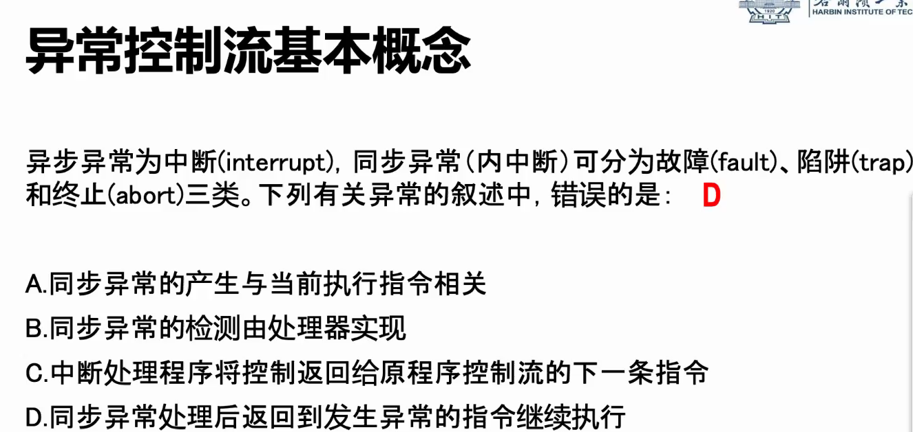
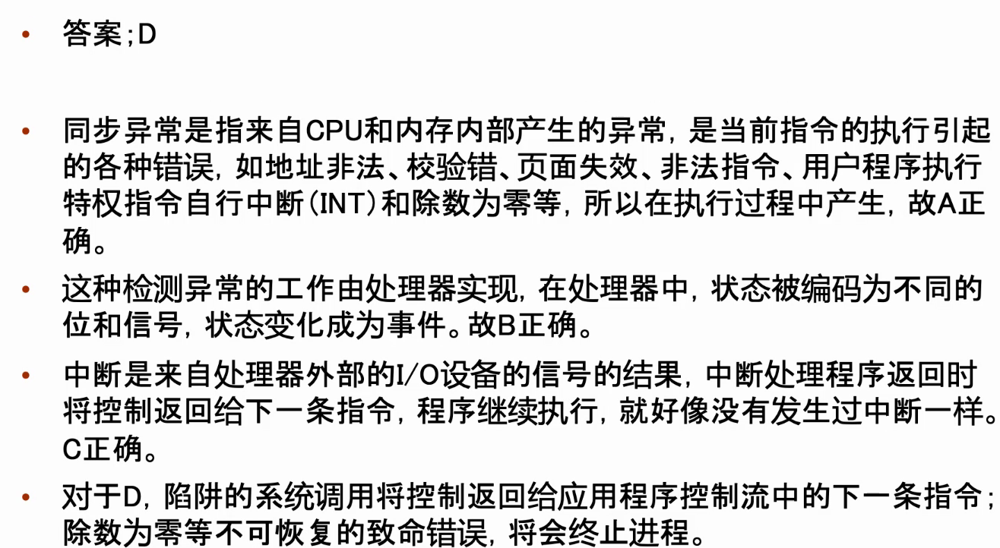

[BSS段通常是指用来存放程序中未初始化的或者初始化为0的全局变量和静态变量的一块内存区域](https://baike.baidu.com/item/BSS%E6%AE%B5/5230776?fr=aladdin)。
在编译`.o`文件时若没有加上`-fno-common`，则gcc在编译时会先把未初始化全局变量放到COMMON段，然后在链接时再放到bss段，如果`.o`文件中有多个同名的则选一个。这就导致gcc默认允许多个`.c`文件中定义同名的未初始化的全局变量。
g++默认加上了这个选项。
参考：<http://blog.chinaunix.net/uid-23629988-id-2888209.html>

linux信号处理机制：
<https://blog.csdn.net/yetugeng/article/details/88086575>
一个是pending位向量，它包含了那些内核发送给进程，但还没有被进程处理掉的信号。
另一个是blocked位向量，它包含了那些被进程屏蔽掉的信号。
