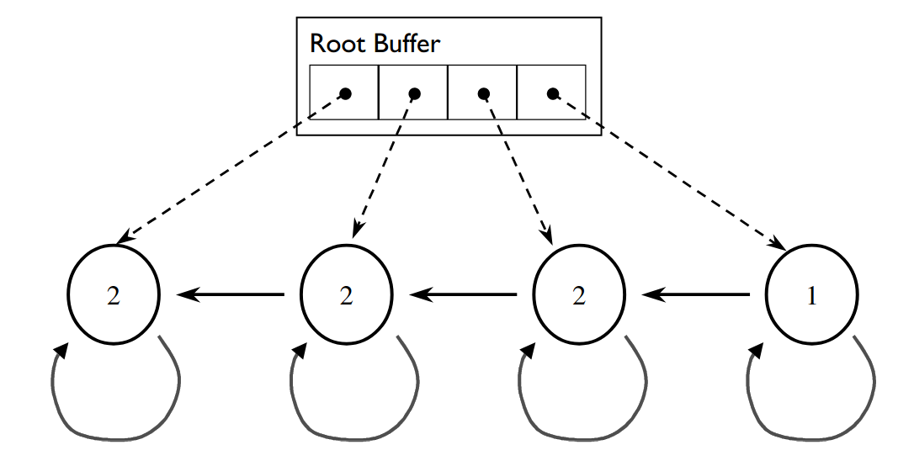

垃圾回收算法分为跟踪式垃圾回收(Tracing garbage collection)和引用计数(Reference counting)两大类。

## 跟踪式垃圾回收

跟踪式垃圾回收的基本原理是先认定一些对象为root，比如全局变量和栈变量。然后跟踪(trace)哪些对象是从这些root可达的，而剩下的从这些root不可达的对象就是garbage，可以被回收。

最简单的方法就是mark-and-sweep。首先stop the world，然后从root开始标记哪些对象是从root可达的(mark)，最后把那些没有标记的对象回收(sweep)。缺点就是需要stop the world，即停止一切其他工作，只进行垃圾回收。

这篇文章说mark-and-sweep不能做到on-the-fly是因为“在不同阶段标记清扫法的标志位 0 和 1 有不同的含义，那么新增的对象无论标记为什么都有可能意外删除这个对象”：<https://zhuanlan.zhihu.com/p/105495961>。但是我觉得新增对象统一染成黑色，下次GC的时候所有对象都变成白色再从根开始染成黑色就行了，这样做的缺点就是新增对象要等到。

我觉得三色标记法(tri-color marking)跟mark-and-sweep基本上是一回事，里面的gray set有点像广度优先搜索的队列。新增对象需要到下次GC才能释放的问题仍然存在。

## 引用计数

使用引用计数进行垃圾回收时，为每个对象保存其被引用的次数，如果引用次数为0，就说明这个对象不可达，就可以被当成垃圾回收掉了。

但是引用计数法存在一些问题。引用计数法需要为每个对象额外存储引用计数，因此会增大空间开销，尤其是当对象比较小的时候。此外，引用计数法需要经常进行加减操作，而且在多线程程序中，引用计数的加减还需要是原子操作，这就引入了很高的额外时间开销。此外，如果当发现引用计数变成0之后当场将其释放掉，那么会导致程序的实时性变差，因为可能会一下子释放很多对象，不过这可以通过将释放的工作交给其他线程做来解决，但是会增加开销，并且减弱垃圾回收的及时性。

以上的问题都是开销方面的。引用计数的一个最致命的问题是，当存在循环引用时，引用计数法将无法将这些循环引用的对象释放，因为它们的引用计数都不是0。一种缓解这种情况的方法是当需要进行双向引用时（例如双向链表），将其中一个引用设置成弱引用，即只引用它，而不增加其引用计数，从而避免了一部分循环引用。但是这种方法不能完全解决循环引用的问题。还有一种方法是周期性进行跟踪式垃圾回收，将不可达的环删掉，如果环的内存占用低，可以减少进行跟踪式垃圾回收的频率。

关于如何回收环，有很多现有的研究。比较基础的是这个：

[Lins, Rafael D. "Cyclic reference counting with lazy mark-scan." Information Processing Letters 44.4 (1992): 215-220.](https://kar.kent.ac.uk/22347/1/CyclicLin.pdf)

基本原理是，一个garbage cycle只有在当一个对象的引用计数被减到非0值时才会产生，因为如果引用计数被加了，那肯定就不是garbage，如果引用计数被减到0了，就是非环的garbage。因此，当一个对象的引用计数被减到非0值时，将其作为candidate root of a garbage cycle，存入root buffer里。在合适的时机，Garbage collector会从root buffer里拿出一个candidate，从它开始进行深度优先搜索，搜到从这个root可达的所有对象，然后对这些对象的每条出边，都将其指向的对象的引用计数减一，这样如果这些对象的引用计数都减为0了，就说明没有其他外部对象引用了这些对象，这些对象就构成了一个garbage cycle，可以回收掉。如果有某个对象的引用计数不为0，就说明有某个外部对象引用了这个对象，因此就不能进行回收，要把所有引用计数复原。但是在这种情况下，这个算法的复杂度是$O(n^2)$的（图片来源是[Bacon and Rajan 2001]的Fig. 1）：

最快的stop the world的好像是这个：

[Bacon, David F., and Vadakkedathu T. Rajan. "Concurrent cycle collection in reference counted systems." European Conference on Object-Oriented Programming. Springer, Berlin, Heidelberg, 2001.](https://dl.acm.org/doi/pdf/10.1145/1255450.1255453)

跟[Lins 1992]不同，[Bacon and Rajan 2001]的最坏时间复杂度是$O(N+E)$的，其中$N$是对象数，$E$是引用数。这个算法与[Lins 1992]的主要区别是，[Lins 1992]是将candidate一个一个从root buffer里拿出来处理，如果发现不能回收，那么就恢复引用计数，然后拿出下一个candidate继续处理，而[Bacon and Rajan 2001]是一次性将整个root buffer里的所有candidate一起处理，从而避免了重复减某一条边指向的对象的引用计数，从而把复杂度控制在$O(N+E)$。[Bacon and Rajan 2001]将垃圾回收分为了三个阶段：`MarkRoots`、`ScanRoots`、`CollectRoots`。灰色代表可能是环的成员，黑色代表可能正在使用所以不能被释放，白色表示是garbage cycle的成员。

`MarkRoots`：把所有root buffer里的candidate拿出来，做深度优先搜索`MarkGray`（`MarkGray`跟[Lins 1992]一致），把所有可达的对象都标记成灰色，并且将这些对象的出边指向的对象的引用计数都减一。

`ScanRoots`：对每个`Markgray`访问到的节点，如果它是灰色的而且引用计数不为0，那么这个节点不是garbage，需要将它以及所有它可达的节点都染成黑色，并且将这些重新被染成黑色的节点的所有出边指向的节点的引用计数都加一。如果它是灰色且引用计数为0，那么就把这个节点染成白色，注意这个时候不代表这个节点就是garbage了，因为后续可能有父节点被染成黑色从而将这个节点重新染成黑色，但是由于一个节点的颜色最多改变常数次，所以不影响复杂度。

`CollectRoots`：经过`ScanRoots`之后，所有灰色节点要么被染成黑色，说明其不能被释放，要么被染成白色，说明所有引用它的节点也都是白色的，这些白色的节点都是garbage，可以被释放。

可以看出，其实这种方法也算是一种启发式的跟踪式垃圾回收。

最快的on-the-fly的好像是这个：

[Paz, Harel, et al. "An efficient on-the-fly cycle collection." ACM Transactions on Programming Languages and Systems (TOPLAS) 29.4 (2007): 20-es.](https://www.researchgate.net/profile/Vadakkedathu-Rajan/publication/2528969_Concurrent_Cycle_Collection_in_Reference_Counted_Systems/links/0c9605177f3187ac92000000/Concurrent-Cycle-Collection-in-Reference-Counted-Systems.pdf)

这篇论文还没看。

## 参考文献

<https://en.wikipedia.org/wiki/Garbage_collection_(computer_science)>

<https://en.wikipedia.org/wiki/Tracing_garbage_collection>

<https://en.wikipedia.org/wiki/Reference_counting>
