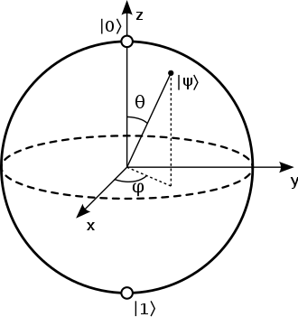
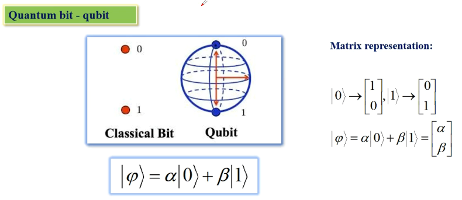
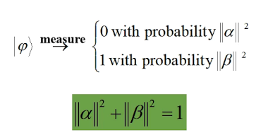
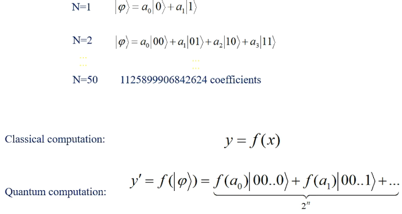
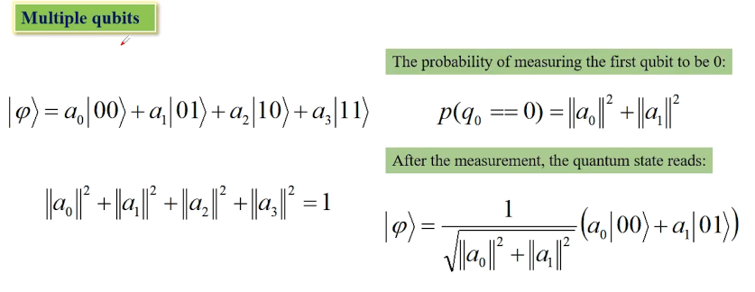
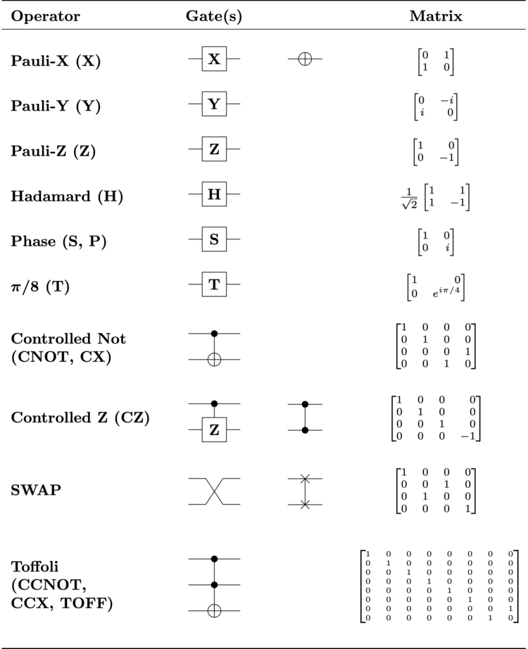

## qubit

经典的bit的状态空间为2，要么是0，要么是1。但是qubit可以同时是0和1，其状态空间可以看作是一个半径为1的球面，如下图Bloch sphere所示。

图片来源：<https://en.wikipedia.org/wiki/Bloch_sphere>

可见，与直觉不同，它有两个自由度。为了简化，将其记为下面的形式：

图片来源：<http://www.asc-events.org/ASC20-21/Trainingcamp.php>

如果进行观测，则量子比特会坍缩成经典bit：

可以看到，影响其坍缩到0还是1的概率的是$\theta$，而$\varphi$不影响。但是有一些量子门可以利用$\varphi$来影响$\theta$。

## 多qubit

有n(n>1)个qubit时，由于它们之间有量子纠缠，所以一个qubit的状态与另一个qubit的状态有关。这样，这些qubit的状态有2的n次方种，每种状态都有自己的概率。对这些qubit的操作都会作用到所有的状态上去。我认为可以理解成超级SIMD。

图片来源：<http://www.asc-events.org/ASC20-21/Trainingcamp.php>

图片来源：<http://www.asc-events.org/ASC20-21/Trainingcamp.php>

## 量子门

内容参考自：<https://en.wikipedia.org/wiki/Quantum_logic_gate>

对量子的操作以量子门的形式进行。量子门有的只操作一个qubit，有的操作多个qubit。

### 操作一个qubit的量子门

$\alpha |0> + \beta |1>$表示成矩阵就是
$\left[
	\begin{matrix}
		\alpha \\
		\beta
	\end{matrix} 
\right]$

#### Pauli-X (X)

显然是交换其0和1的状态的概率。wiki上说是相当于绕x轴旋转180度，但是旋转之后$\theta$变成了$\pi - \theta$，$\varphi$变成了$-\varphi$，代进式子发现是$sin \frac{\theta}{2} |0> + e^{-i\varphi} cos \frac{\theta}{2} |1>$，而不是$e^{i\varphi}sin \frac{\theta}{2} |0> + cos \frac{\theta}{2} |1>$？？？

### Controlled Not (CNOT, CX)

相当于对于第一个qubit为1的情况，将第二个qubit的0和1反过来。
