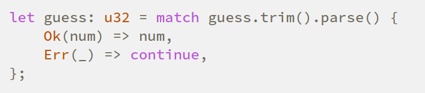

## 安装

```shell
curl --proto '=https' --tlsv1.2 -sSf https://sh.rustup.rs | sh
```

或者：

安装rust之后`rustup doc`，文档就会在浏览器里打开。点击里面的The Rust Programming Language，就可以看到入门书的网页版了。

升级：`rustup update`

安装Nightly toolchain:

```shell
rustup toolchain install nightly
```

参考：

<https://rust-lang.github.io/rustup/basics.html#keeping-rust-up-to-date>

<https://rust-lang.github.io/rustup/concepts/channels.html>

<https://stackoverflow.com/questions/66681150/how-to-tell-cargo-to-use-nightly>

## cargo

### 文档

```shell
cargo doc --open
```

可以生成并在浏览器打开项目的文档。

### 新建项目

```shell
cargo new <项目名>
```

### `Cargo.toml`

- 

#### `version`

指定crate的版本。如果把crate托管在github上的话，如果连续几个commit里的version都相同，那么实际上只取最早的那个commit作为这个version的crate。因此假如把一个version push到github之后，如果又进行了修改，那么需要更改version code才能让用户使用新的修改。

#### `[dev-dependencies]`

定义只在test里用的依赖：<https://stackoverflow.com/questions/29857002/how-to-define-test-only-dependencies>

### Blocking waiting for file lock on package cache

```shell
rm -rf ~/.cargo/registry/index/*
rm ~/.cargo/.package-cache
```

<https://stackoverflow.com/questions/47565203/cargo-build-hangs-with-blocking-waiting-for-file-lock-on-the-registry-index-a#answer-53066206>

## 标准库

### 字符串成员函数

- trim
去掉前后空格。
- parse
把字符串转成特定类型（通过要被赋值给的变量确定？）

### 排序

复杂度稳定的排序用`sort_by`：<https://doc.rust-lang.org/std/primitive.slice.html#method.sort_by>

复杂度不稳定但是常数小的排序用`sort_unstable_by`：<https://doc.rust-lang.org/std/primitive.slice.html#method.sort_unstable_by>

### Entry API

以BTreeMap的Entry API为例。基础用法见标准库文档：<https://doc.rust-lang.org/stable/std/collections/struct.BTreeMap.html#method.entry>

但是基础的`and_modify`和`or_insert_with`接口有个问题，就是它们虽然是互斥的，但是却不能把一个object的ownership同时传给这两个接口。要解决这个问题，假如这个object有一个empty的状态，可以先`or_insert`把它变成empty，再进行修改操作。来源：<https://users.rust-lang.org/t/hashmap-entry-api-and-ownership/81368>

另一种比较通用的方法是用`match`判断返回的Entry是Occupied还是Vacant，这样编译器就知道这两种情况是互斥的了。

`match`的另一个例子：modify and optionally remove

```rs
use std::collections::btree_map::{self, BTreeMap};

fn pop(m: &mut BTreeMap<u32, Vec<u32>>, key: u32) -> Option<u32> {
    match m.entry(key) {
        btree_map::Entry::Occupied(mut entry) => {
            let values = entry.get_mut();
            let ret = values.pop();
            if values.is_empty() {
                entry.remove();
            }
            ret
        }
        btree_map::Entry::Vacant(_) => {
            None
        }
    }    
}
fn main() {
    let mut m: BTreeMap<u32, Vec<u32>> = BTreeMap::new();
    m.insert(1, vec![2, 3]);
    assert_eq!(pop(&mut m, 1), Some(3));
    assert_eq!(pop(&mut m, 1), Some(2));
    assert!(m.is_empty());
}
```

参考：

<https://doc.rust-lang.org/stable/std/collections/btree_map/enum.Entry.html>

<https://doc.rust-lang.org/stable/std/collections/btree_map/struct.VacantEntry.html>

### mpsc

需求：需要在一个线程里读取数据，发送给另一个线程处理。

我的方法：用mpsc的channel发送和接收。

坑：mpsc的channel从不阻塞发送方，它有无限的缓冲。结果读取远远比写入快，导致大量内存被消耗。

解决方案：用`sync_channel`：

```rs
pub fn sync_channel<T>(bound: usize) -> (SyncSender<T>, Receiver<T>)
```

这个bound参数应该指的是个数。

文档：<https://doc.rust-lang.org/stable/std/sync/mpsc/index.html>

## Crates

enum_iterator: <https://docs.rs/enum-iterator/latest/enum_iterator/>

可以获取enum的可能取值个数。

num-derive: <https://docs.rs/num-derive/latest/num_derive/>

可以把enum转成基本类型。

### serde

- 

- 

- <https://serde.rs/attr-skip-serializing.html>

- <https://serde.rs/lifetimes.html>

- <https://github.com/serde-rs/json#operating-on-untyped-json-values>

- <https://serde.rs/impl-deserialize.html>

### clap

官方文档：<https://docs.rs/clap/latest/clap/>

derive的用法：<https://docs.rs/clap/latest/clap/_derive/index.html>

#### `#[arg(...)]`

##### `short`

自动取field name的首字母作为参数名。

也可以`short = 'x'`指定参数名。

##### `default_value_t`

```text
default_value_t [= <expr>]
```

`_t`后缀应该是type的意思。

#### Positional arguments

不指定`short`之类的，默认就是positional argument。

## API guidelines

### Generic reader/writer functions take R: Read and W: Write by value (C-RW-VALUE)

<https://rust-lang.github.io/api-guidelines/interoperability.html#generic-readerwriter-functions-take-r-read-and-w-write-by-value-c-rw-value>

[What is the reason for C-RW-VALUE?](https://github.com/rust-lang/api-guidelines/issues/174)

## 类型转换

### int <-> `[u8]`



### `Vec<u8>` -> `String`

<https://stackoverflow.com/questions/19076719/how-do-i-convert-a-vector-of-bytes-u8-to-a-string>

<https://doc.rust-lang.org/stable/std/string/struct.String.html#method.from_utf8>

### `Vec<T>` -> `[T; N]`

用`try_into`: <https://stackoverflow.com/questions/29570607/is-there-a-good-way-to-convert-a-vect-to-an-array>

### char -> u8

<https://users.rust-lang.org/t/how-to-convert-char-to-u8/50195>

### C语言字符串转String

原文：<https://stackoverflow.com/questions/24145823/how-do-i-convert-a-c-string-into-a-rust-string-and-back-via-ffi>

```rs
use std::ffi::CStr;
let c_buf: *const c_char = unsafe { hello() };
let c_str: &CStr = unsafe { CStr::from_ptr(c_buf) };
let str_slice: &str = c_str.to_str().unwrap();
let str_buf: String = str_slice.to_owned();  // if necessary
```

## 语法

[Rust for循环](https://www.yiibai.com/rust/rust-for-loop.html)

- `_`是通配符



这里指匹配所有的Err，不管里面是啥。

<https://users.rust-lang.org/t/calling-function-in-struct-field-requires-extra-parenthesis/14214/2>

## I/O

- 

- 

- 

- 

- 

- 

- 

- 

- 

- 

### 读取命令行参数

```rs
use std::io;
use std::env;
use std::error::Error;

fn main() -> Result<(), Box<dyn Error>> {
    let mut args = env::args();
    let arg0 = args.next().unwrap();
    // args.len(): Returns the exact remaining length of the iterator.
    if args.len() != 1 {
        eprintln!("{} dump-file", arg0);
        return Err(Box::new(io::Error::new(
            io::ErrorKind::Other,
            "Invalid arguments",
        )));
    }
    let file_path = args.next().unwrap();
    println!("{}", file_path);
    Ok(())
}
```

参考：[Rust编程知识拾遗：Rust 编程，读取命令行参数](https://blog.csdn.net/lcloveyou/article/details/105595040)

## trait

Rust的trait相当于定义了这个类型有哪些接口。定义了trait之后，可以对已知类型实现这个trait:

```rs
trait A {
    fn a() -> i32;
}
impl A for f32 {
    fn a() -> i32 {
        return 2333;
    }
}
fn main() {
    // 2333
    println!("{}", f32::a());
}
```

相关：

<https://stackoverflow.com/questions/44445730/how-to-call-a-method-when-a-trait-and-struct-use-the-same-method-name>

<https://users.rust-lang.org/t/box-with-a-trait-object-requires-static-lifetime/35261>

### Associated type

```rs
trait A {
    type T;
}
```

如果`B: A`，一般可以这样访问`T`: `B::T`。但是在template argument中比较特殊：`<B as A>::T`。例子：

```rs
trait A {
    type T;
}
struct C<B: A, C = <B as A>::T> { a: B, at: C }
```

### Universal call syntax

文档：<https://doc.rust-lang.org/reference/expressions/call-expr.html#disambiguating-function-calls>

主要用来call指定trait的某个method：

```rs
<T as TraitA>::method_name(xxx)
```

### 约束不同类型的associated type相等

这是一个未实现的特性：<https://github.com/rust-lang/rust/issues/20041>

但是可以绕过去：<https://stackoverflow.com/questions/66359551/alternative-to-equality-constraints-for-associated-types>

### FnOnce, FnMut, Fn

<https://stackoverflow.com/questions/30177395/when-does-a-closure-implement-fn-fnmut-and-fnonce>

但是如果要构造function array的话，好像只能用`fn`类型，也就是普通函数：<https://stackoverflow.com/questions/31736656/how-to-implement-a-vector-array-of-functions-in-rust-when-the-functions-co>

### Higher-Rank Trait Bounds (HRTBs)

官方文档：<https://doc.rust-lang.org/nomicon/hrtb.html>

基本语法：`T: for<'a> TraitName<'a>`

相当于对所有的lifetime，`T`都要满足这个trait bound。例子：

```rs
use std::ops::SubAssign;
fn func<T>(a: &mut T, b: &T)
where
    T: for<'a> SubAssign<&'a T>,
{
    *a -= b;
}
fn main() {
    let mut a = 2;
    let b = 1;
    func(&mut a, &b);
    println!("{}", a);
}
```

## 多线程

- 原子量：<https://doc.rust-lang.org/std/sync/atomic/index.html>

- 读写锁：<https://doc.rust-lang.org/stable/std/sync/struct.RwLock.html>

- 

- 

### channel

标准库里的mpsc对应的`select!`已经deprecated了。可以考虑使用crossbeam-channel: <https://docs.rs/crossbeam-channel/latest/crossbeam_channel/>

select: <https://docs.rs/crossbeam-channel/latest/crossbeam_channel/macro.select.html>

## 错误处理

### 让main函数兼容多种Error

```rs
use std::error::Error;
fn main() -> Result<(), Box<dyn Error>> {
```

### 将多种Error通过channel发送出去

`Box<dyn Error>`是没法通过channel发送出去的。可以枚举出有哪些种类的Error，然后手搓一个enum表示它，这样就可以发送出去了：

```rs
enum FlushError {
    Bincode(bincode::Error),
    Io(io::Error),
}
impl From<bincode::Error> for FlushError {
    fn from(e: bincode::Error) -> Self {
        Self::Bincode(e)
    }
}
impl From<io::Error> for FlushError {
    fn from(e: io::Error) -> Self {
        Self::Io(e)
    }
}
```

参考：

<https://fettblog.eu/rust-enums-wrapping-errors/>

<https://stackoverflow.com/questions/71977024/rust-cannot-send-unwrapped-result-data-across-await-point>

## 获得`Vec`里多个元素的mutable reference

比如要获得`a[1]`和`a[3]`的可变引用，可以用iterator:

```rs
fn main() {
    let mut a = vec![0, 1, 2, 3, 4, 5];
    let mut iter = a.iter_mut();
    let a1 = iter.nth(1).unwrap();
    let a3 = iter.nth(3 - 1 - 1).unwrap();
    *a1 = -1;
    *a3 = -1;
    println!("{:?}", a);
}
```

也可以用nightly特性`get_many_mut`:

```rs
#![feature(get_many_mut)]
fn main() {
    let mut a = vec![0, 1, 2, 3, 4, 5];
    let [a1, a3] = a.get_many_mut([1, 3]).unwrap();
    *a1 = -1;
    *a3 = -1;
    println!("{:?}", a);
}
```

## struct成员变量默认值

<https://stackoverflow.com/questions/19650265/is-there-a-faster-shorter-way-to-initialize-variables-in-a-rust-struct>

## 生成随机数

用`rand` crate。文档：<https://docs.rs/rand/latest/rand/>。

基础用法：<https://docs.rs/rand/latest/rand/#quick-start>

自带的随机数生成器：<https://docs.rs/rand/latest/rand/rngs/index.html>

如果需要指定随机种子的话，一般`rand::rngs::StdRng`即可满足需求，文档：<https://docs.rs/rand/latest/rand/rngs/struct.StdRng.html>

一些自带的分布：<https://docs.rs/rand/latest/rand/distributions/index.html>

比较常见的均匀分布：<https://docs.rs/rand/latest/rand/distributions/struct.Uniform.html>

## lower_bound / upper_bound

<https://stackoverflow.com/questions/48575866/how-to-get-the-lower-bound-and-upper-bound-of-an-element-in-a-btreeset>

## Module

<https://doc.rust-lang.org/book/ch07-05-separating-modules-into-different-files.html>

## 条件编译

官方文档：<https://doc.rust-lang.org/reference/conditional-compilation.html>

<https://stackoverflow.com/questions/29857002/how-to-define-test-only-dependencies>

仅在测试时derive: `#[cfg_attr(test, derive(Deserialize))]`。来源：<https://www.reddit.com/r/rust/comments/nwywqx/conditionally_derive_for_integration_tests/>

仅在测试时`impl`:

```rs
#[cfg(test)]
impl Default for Status {
```

## 其他

<https://stackoverflow.com/questions/60253791/why-can-i-not-mutably-borrow-separate-fields-from-a-mutex-guard>

## RFC

[Multiple Attributes in an Attribute Container](https://github.com/rust-lang/rfcs/pull/2600) (postponed)

支持不允许Drop的类型：[https://github.com/rust-lang/rfcs/pull/776] (postponed)

[Improving Entry API to get the keys back when they are unused](https://github.com/rust-lang/rfcs/issues/690)

## 已知问题

### Non-lexical lifetimes (NLL)

来源：<https://blog.rust-lang.org/2022/08/05/nll-by-default.html>

```rs
fn last_or_push<'a>(vec: &'a mut Vec<String>) -> &'a String {
    if let Some(s) = vec.last() { // borrows vec
        // returning s here forces vec to be borrowed
        // for the rest of the function, even though it
        // shouldn't have to be
        return s;
    }

    // Because vec is borrowed, this call to vec.push gives
    // an error!
    vec.push("".to_string()); // ERROR
    vec.last().unwrap()
}
```

```text
error[E0502]: cannot borrow `*vec` as mutable because it is also borrowed as immutable
  --> a.rs:11:5
   |
1  | fn last_or_push<'a>(vec: &'a mut Vec<String>) -> &'a String {
   |                 -- lifetime `'a` defined here
2  |     if let Some(s) = vec.last() { // borrows vec
   |                      ---------- immutable borrow occurs here
...
6  |         return s; 
   |                - returning this value requires that `*vec` is borrowed for `'a`
...
11 |     vec.push("".to_string()); // ERROR
   |     ^^^^^^^^^^^^^^^^^^^^^^^^ mutable borrow occurs here
```

这是因为`s` borrow了`vec`之后，`s`是conditional return的，但是编译器仍然将对`vec`的borrow拓展到所有条件分支了，就导致另一个没有borrow `vec`的分支也被认为borrow了`vec`，就编译报错了。

据说下一代borrow checker polonius可以解决这个问题。现在只能通过推迟对`vec`的borrow绕过这个问题：

```rs
fn last_or_push<'a>(vec: &'a mut Vec<String>) -> &'a String {
    if !vec.is_empty() {
        let s = vec.last().unwrap(); // borrows vec
        return s; // extends the borrow 
    }
    
    // In this branch, the borrow has never happened, so even
    // though it is extended, it doesn't cover this call;
    // the code compiles.
    //
    // Note the subtle difference with the previous example:
    // in that code, the borrow *always* happened, but it was
    // only *conditionally* returned (but the compiler lost track
    // of the fact that it was a conditional return).
    //
    // In this example, the *borrow itself* is conditional.
    vec.push("".to_string());
    vec.last().unwrap()
}

fn main() { }
```

### 调试时不能执行复杂代码

<https://stackoverflow.com/questions/68232945/execute-a-statement-while-debugging-in-rust>

### Raw pointers are `!Sync` and `!Send`

<https://doc.rust-lang.org/nomicon/send-and-sync.html>

主要目的是防止含有裸指针的struct被自动标记为thread-safe。

所以如果需要在不同线程之间共享裸指针，而且可以保证裸指针引用的部分已经做了并发控制的话，可以写一个wrapper：

```rs
struct ThreadSafePtr<T>(*mut T);
unsafe impl<T> Send for ThreadSafePtr<T> {}
unsafe impl<T> Sync for ThreadSafePtr<T> {}
```

但我觉得应该让raw pointer本身是thread safe的，然后在编译器层面不让含有裸指针的struct被自动标记为thread safe。

相关讨论：<https://internals.rust-lang.org/t/shouldnt-pointers-be-send-sync-or/8818>

### drop的时候拿的是mutable reference而不是ownership

<https://stackoverflow.com/questions/30905826/why-does-drop-take-mut-self-instead-of-self>

这是为了防止编译器在`drop`的最后又自动调用`drop`。

如果需要在drop的时候consume某个field，可以通过把这个field放在`Option`里实现。或者把这个field用`unsafe`的`ManuallyDrop`包起来，然后在`drop`的时候`take`：<https://users.rust-lang.org/t/can-drop-handler-take-ownership-of-a-field/74301/7>

我觉得最好的实现应该是让`drop`拿ownership，然后在编译器里特殊处理这个case，在`drop`的最后不再调用`drop`。但是rust核心开发者觉得这个特性需要对编译器做太多修改：<https://github.com/rust-lang/rust/issues/4330>

### 如果有自定义的`Drop::drop`，就不能单独拿某个field的ownership
