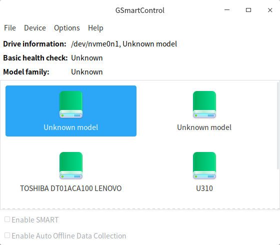
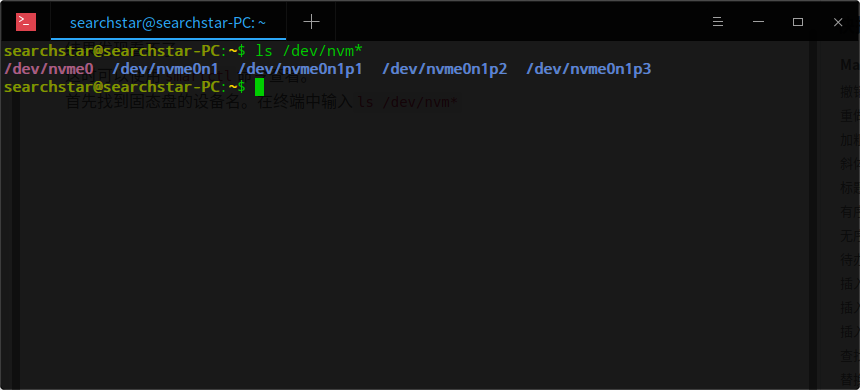
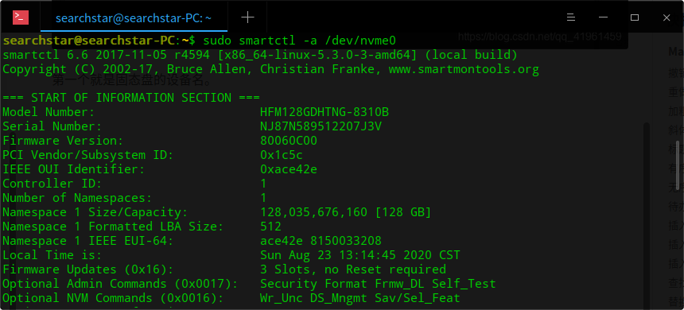
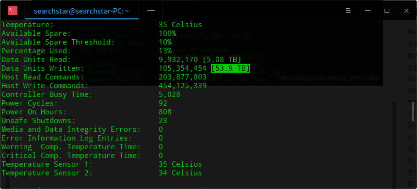

```shell
sudo apt install gsmartcontrol
```
然后`smartctl`命令就有了。
先尝试直接打开gmartcontrol（通过终端或者启动器）

结果发现看不了。
这时可以使用`smartctl`命令查看。
首先找到固态盘的设备名。在终端中输入`ls /dev/nvm*`

第一个就是固态盘的设备名。
然后输入
```shell
sudo smartctl -a /dev/nvme0
```


这个就是写入量（为什么写入量比读出量高这么多）
