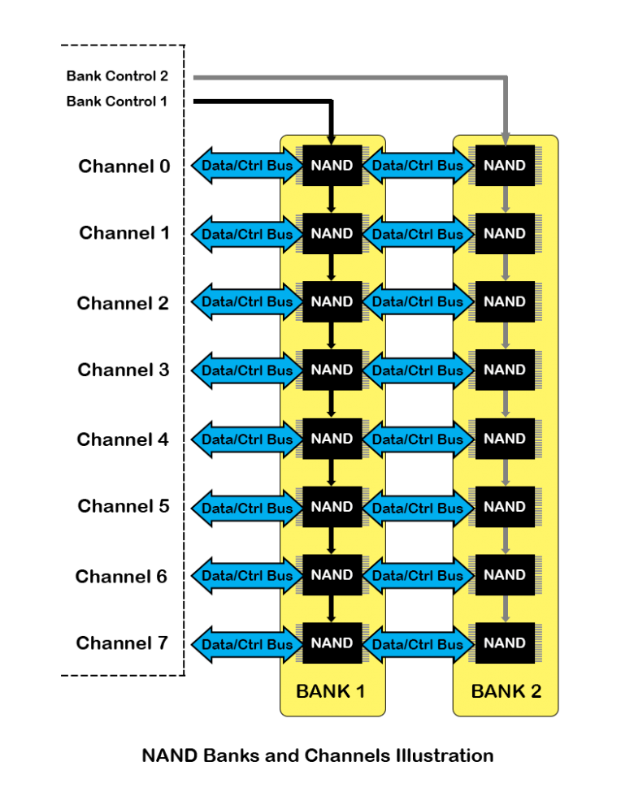

闪存从大到小可以分成这几个层级。

首先是Channel、Bank、Chip的关系：

图片来源：<https://www.cactus-tech.com/resources/blog/details/solid-state-drive-primer-8-controller-architecture-channels-and-banks/>

- Channel: Controller可以同时访问的chip的个数。

- Bank: 一块SSD？

- chip(package): 闪存的封装。

- die: 晶片。生产的最小单元。每个chip中通常有多个die。

- plane: 各个plane可以并行执行指令。每个die中有一个或多个plane。

- block: 擦除的最小单位。擦除了之后才能写入。每个plane中有多个block。

- page: 写入的最小单位。每个block中有多个page。由于一个块只有被擦除之后才能写入，所以如果应用程序请求overwrite一个ssection，那么就要把新的数据写到另一个block里，然后原来的作废。

原文：<https://flashdba.com/2014/06/20/understanding-flash-blocks-pages-and-program-erases/>

浮栅晶体管，SLC，MLC，TLC：<https://blog.csdn.net/juS3Ve/article/details/93679509>

[初识flash芯片----写之前为什么要先擦除](https://blog.csdn.net/frank_jb/article/details/123781097)
