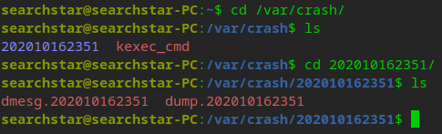
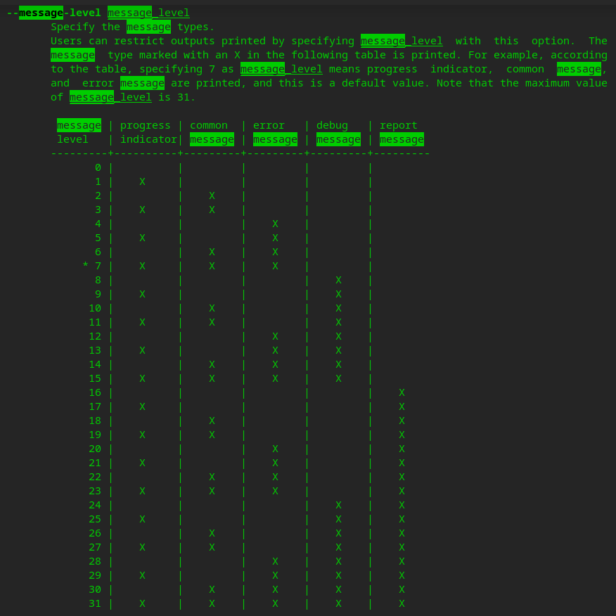
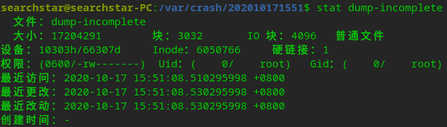
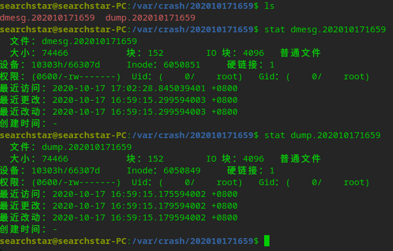

由于panic后内核不能再将dmesg写入到存储介质中去，所以重启之后dmesg就丢失了。但是kdump可以在内核panic后启用一个小内核来将dmesg和一些内存信息写进存储介质。

# 安装`kdump`
## debian系列(我用的deepin v20)
```shell
sudo apt install -y kdump-tools
```
选项都选`是`就好了。

根据[这篇文章](https://www.cnblogs.com/zhangmingda/p/12566534.html)，默认给crash kernel分配的内存太少了，所以修改`/etc/default/grub.d/kdump-tools.cfg`：`crashkernel=512M-:768M`，然后`grub-mkconfig -o /boot/grub/grub.cfg `（如果是grub2就是`sudo grub2-mkconfig -o /boot/grub2/grub.cfg`）。然后重启，使修改生效。

## centos
看这里：<https://www.jianshu.com/p/8e031b28d98b>
但是其中的
```
core_collector makedumpfile -c -l -message-level 1 -d 31
```
应该改为
```
core_collector makedumpfile -c -l --message-level 1 -d 31
```
即`message-level`前面应该有两个`-`。

# 手动触发panic
```shell
echo 1 > /proc/sys/kernel/sysrq
echo c > /proc/sysrq-trigger  # 或者Alt+SysRq+c
```
然后等一段时间（可能有点长，因为要把内存镜像写入到`/var/crash`）
然后就会自动重启，重启完了之后到`/var/crash`下就可以看到保存下来的dmesg了：


# 减少dump文件的大小
参考：<https://blog.csdn.net/dongfei2033/article/details/87095938>
```shell
man makedumpfile
```


可以看到默认的消息等级（打星星的7）会打印`common message`，生成的dump文件很大。所以我们把它改成1，只打印`process indicator`：编辑`/etc/default/kdump-tools`，在里面加上
```
MAKEDUMP_ARGS="-c --message-level 1 -d 31"
```

现在dump文件只有17MB了。

# 禁止生成vmcore
vmcore文件很大，生成要花费大量时间。我们这里只需要dmesg，所以可以禁止生成vmcore。
编辑`/etc/default/kdump-tools`
```
MAKEDUMP_ARGS="-c -d 31 --message-level 0 --dump-dmesg"
```
其中`--dump-dmesg`表示直接把dmesg抽出来，而不生成vmcore。

现在生成的文件都很小了，重启也非常快。

参考文献：<https://www.reddit.com/r/Fedora/comments/84ffrf/how_to_capture_kernel_panic_logs_during_reboot/>
