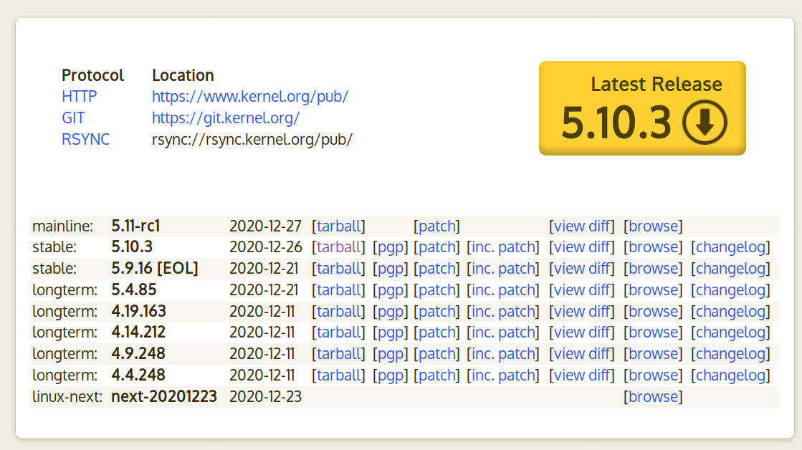
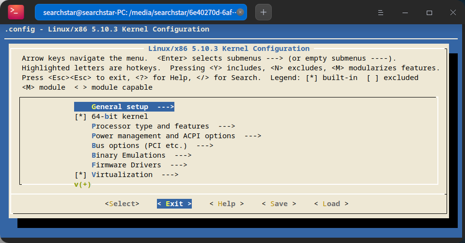

## 下载内核

<https://www.kernel.org/>



一般下载tarball，也就是.tar.xz格式的源码包。如果`/`够大，可以直接解压到`/usr/src`，也可以解压到机械盘上。

## 配置

### 编辑`.config`

一些常用的配置：

#### KASAN

KASAN是一个动态检测内存错误的工具：[在Linux内核使用Kasan](https://blog.csdn.net/weiqifa0/article/details/120359407)

```text
CONFIG_SLUB_DEBUG=y
CONFIG_KASAN=y
```

### make menuconfig

如果手动编辑了`.config`的话，这一步可能会根据手动编辑的内容调整一些其他选项，比如如果设置了`CONFIG_KASAN=y`，执行`make menuconfig`后会自动加上`CONFIG_KASAN_GENERIC=y`和`CONFIG_KASAN_OUTLINE=y`。

```shell
sudo apt install -y flex bison libelf-dev
make menuconfig
```

如果没有特殊需求，可以直接按右键头选中Exit



然后按enter，选保存即可。

## make

多线程编译

```shell
make -j$(nproc) > /dev/null
```

`> /dev/null`是为了防止warning和error被刷掉，比如让我们装`libelf-dev`的警告。

## 安装到系统目录

### 内核模块

如果没有特殊需求，一般可以把内核模块的debug信息给去掉，节约安装空间。

```shell
make INSTALL_MOD_STRIP=1 modules_install > /dev/null
```

注意对于centos不能`INSTALL_MOD_STRIP=1`，不然启动貌似会出问题。应该

```shell
make modules_install
```

然后再用这里的方法去`/usr/lib/modules`里手动把debug信息去掉：



### 内核

```shell
make install
```

如果有类似于这样的报错：

```text
没有规则可制作目标“certs/rhel.pem”，由“certs/x509_certificate_list” 需求。
```

那可能要把`.config`里的`CONFIG_SYSTEM_TRUSTED_KEYS`后面引号里的东西删掉。

另外要注意看看有没有要我们安装`console-setup`和`plymouth-themes`的提示。

参考：[make[1]: *** 没有规则可制作目标“debian/canonical-certs.pem”，由“certs/x509_certificate_list” 需求。 停止。](https://blog.csdn.net/Chenciyuan_nj/article/details/115099040)

### （可选）用于编译内核模块的文件

这个安装的头文件只能给用户态程序用，不能用于编译内核模块：

```shell
# make INSTALL_HDR_PATH=指定目录 headers_install
make headers_install
```

如果用包管理器安装`linux-headers-xxx`的话，会把头文件安装在`/usr/src/linux-headers-xxx-amd64`和`/usr/src/linux-headers-xxx-common`下面，里面有用的只有这几个文件或文件夹：

```text
arch/x86/include/ arch/x86/Makefile* include/ Makefile Module.symvers scripts/ tools/
```

所以如果要安装用于编译内核模块的文件到系统目录，只需要把这些文件或文件夹放进`/usr/src/linux-headers-我们编译的内核版本`即可。

之前安装的内核模块的目录`/usr/lib/modules/我们编译的内核版本`里的`build`和`source`符号链接原先是指向编译时使用的源码的路径，现在改到`/usr/src/linux-headers-我们编译的内核版本/`即可。

## 安装到指定目录

这样可以在服务器上编译内核，安装到`指定目录`，然后`指定目录`打包传到目标机器，再安装到目标机器上的系统目录即可。

### 内核模块

把内核模块安装到`指定目录/lib/modules/$kernel_version_to_install`：

```shell
INSTALL_MOD_PATH=指定目录 make modules_install
#INSTALL_MOD_PATH=指定目录 make INSTALL_MOD_STRIP=1 modules_install
```

### 内核

把`System.map-$kernel_version_to_install`和`vmlinuz-$kernel_version_to_install`安装到`指定目录`下面：

```shell
INSTALL_PATH=指定目录 make install
```

会报错：

```text
ln: 无法创建符号链接'/boot/System.map': 权限不够
ln: 无法创建符号链接'/boot/vmlinuz': 权限不够
ln: 无法创建符号链接'/boot/System.map': 权限不够
```

不用管这个报错，因为我们不安装到系统目录。

### （可选）内核配置

把`config-$kernel_version_to_install`安装到`指定目录`下：

```shell
kernel_version_to_install=$(make kernelrelease)
cp .config 指定目录/config-$kernel_version_to_install
```

### （可选）用于编译内核模块的文件

把这些文件安装到`指定目录/linux-headers-$kernel_version_to_install`：

```shell
kernel_version_to_install=$(make kernelrelease)
header_dir=指定目录/linux-headers-$kernel_version_to_install
mkdir -p /arch/x86/
cp -r arch/x86/include/ arch/x86/Makefile* $header_dir/arch/x86/
cp -r include/ Makefile Module.symvers scripts/ tools/ $header_dir/
```

### 在目标机器上安装到系统目录

在编译服务器上把`指定目录`压缩，传输到目标机器上，解压出来，进入`指定目录`，然后执行以下指令来安装到目标机器上的系统目录里：

```shell
kernel_version_to_install=$(ls lib/modules/)
# 内核模块
sudo cp -r lib/modules/$kernel_version_to_install /lib/modules/
# 内核
sudo cp -r vmlinuz-$kernel_version_to_install System.map-$kernel_version_to_install /boot/
# （可选）安装内核配置
sudo cp config-$kernel_version_to_install /boot/
# （可选）安装用于编译内核模块的文件
sudo rm -rf /usr/src/linux-headers-$kernel_version_to_install
sudo cp -r linux-headers-$kernel_version_to_install/ /usr/src/linux-headers-$kernel_version_to_install
sudo rm /lib/modules/$kernel_version_to_install/build /lib/modules/$kernel_version_to_install/source
sudo ln -s /usr/src/linux-headers-$kernel_version_to_install/ /lib/modules/$kernel_version_to_install/build
sudo ln -s /usr/src/linux-headers-$kernel_version_to_install/ /lib/modules/$kernel_version_to_install/source
```

然后给刚刚安装的内核生成initramfs：

## 更新grub

如果电脑上装了多个linux，那选系统界面的grub可能不是当前系统提供的，这个时候就要去提供grub的那个系统更新grub才行。

### Debian系

```shell
sudo update-grub
```

### CentOS

```shell
# Legacy启动
sudo grub2-mkconfig -o /boot/grub2/grub.cfg
# EFI启动
sudo grub2-mkconfig -o /boot/efi/EFI/centos/grub.cfg
```

CentOS的启动内核是通过grubby设置的，所以CentOS的`grub2-mkconfig`可能只会输出发现的其他操作系统的启动项，比如只输出`Windows`：

```text
Generating grub configuration file ...
Found Windows Boot Manager on /dev/sda1@/efi/Microsoft/Boot/bootmgfw.efi
Adding boot menu entry for EFI firmware configuration
done
```

但是其实也同时把当前操作系统的内核给识别出来了。

## 设置默认内核

CentOS使用grubby来管理启动项，因此需要使用grubby来设置默认内核：

```shell
sudo grubby --add-kernel=/boot/vmlinuz-xxxx --title="随便写点啥"
sudo grubby --set-default=/boot/vmlinuz-xxxx
```

如果可以与GRUB菜单交互，那么也可以这样：

参考：<https://www.golinuxcloud.com/grubby-command-examples/>

## 删除旧内核（可选）

<https://www.cnblogs.com/amanlikethis/p/3599170.html>
