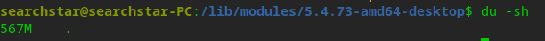
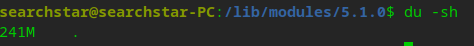

原因是编译出来的ko文件里有一些debug信息。安装module的时候加一个strip选项，把这些额外信息去掉就好了。
```shell
sudo make INSTALL_MOD_STRIP=1 modules_install
```

如果已经安装了，想减少/lib/modules占用的体积，可以直接用strip命令进行裁剪
```shell
sudo bash -c 'find . -iname "*.ko" | xargs strip --strip-unneeded'
```


参考文献：<https://unix.stackexchange.com/questions/288438/why-is-lib-modules-so-huge-under-my-gentoo-compared-to-ubuntu>
