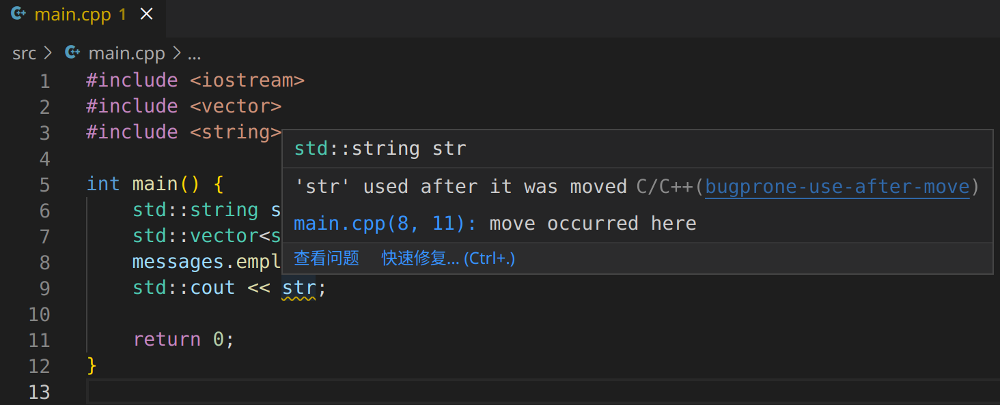

安装`C/C++`插件：<https://marketplace.visualstudio.com/items?itemName=ms-vscode.cpptools>

然后在设置中将这两项勾上，使得`clang-tidy`能够自动运行：

```text
C_Cpp › Code Analysis › Clang Tidy: Enabled
C_Cpp › Code Analysis: Run Automatically
```

默认似乎是不做任何检查的。需要在`C_Cpp › Code Analysis › Clang Tidy › Checks: Enabled`中启用需要的检查，各种检查的文档可以在这里找到：<https://clang.llvm.org/extra/clang-tidy/checks/list.html>。例如`bugprone-use-after-move`的文档在这里：<https://clang.llvm.org/extra/clang-tidy/checks/bugprone/use-after-move.html>

举个例子，只启用`bugprone-use-after-move`，然后创建一个vscode工程：

```cpp
#include <iostream>
#include <vector>
#include <string>

int main() {
	std::string str = "Hello, world!\n";
	std::vector<std::string> messages;
	messages.emplace_back(std::move(str));
	std::cout << str;

	return 0;
}
```

效果：
