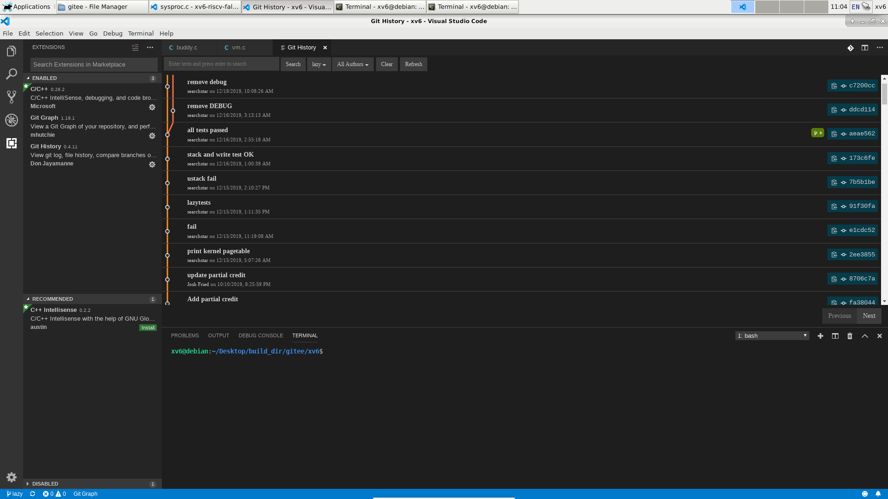
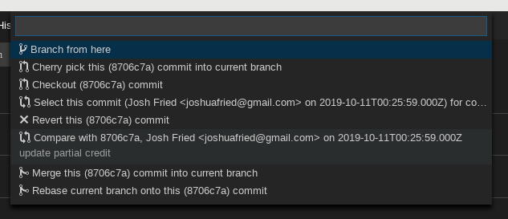
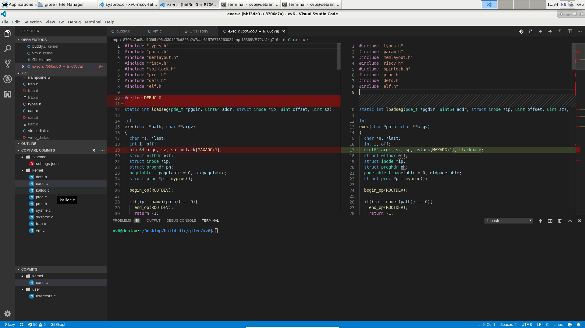

先安装一个叫做”Git History“的插件。
然后在右上方会出现这个

点击之

然后点击要比较的第一个commit的commit id左边的这个图标

上面会弹出

选择Select this commit \<commit id\>，选定要比较的第一个commit。

然后点击要比较的第二个commit的commit id左边的图标，在弹出的选择框里选择
Compare with \<commit id\>

然后左边会出现COMPARE COMMITS。点击里面的文件就可以看到两个commit之间的不同了

