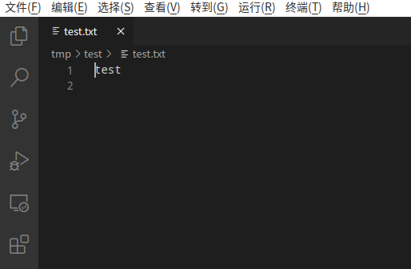
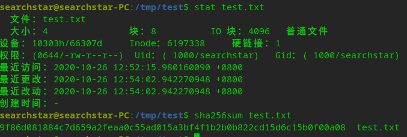

例如在文件```test.txt```里写入
```
test
```
没有换行。

然后
```shell
sha256sum test.txt
```
出来的结果是
```
f2ca1bb6c7e907d06dafe4687e579fce76b37e4e93b7605022da52e6ccc26fd2  test.txt
```
但是在这个网站上
<http://encode.chahuo.com/>
输入test，然后以sha256方式哈希得到的结果是
```
9f86d081884c7d659a2feaa0c55ad015a3bf4f1b2b0b822cd15d6c15b0f00a08
```
两者不一致。
```shell
stat test.txt
```
```
  文件：test.txt
  大小：5         	块：8          IO 块：4096   普通文件
设备：10301h/66305d	Inode：270564      硬链接：1
权限：(0644/-rw-r--r--)  Uid：( 1000/searchstar)   Gid：( 1000/searchstar)
最近访问：2020-04-23 11:53:08.989247877 +0800
最近更改：2020-04-23 11:53:03.077686032 +0800
最近改动：2020-04-23 11:53:03.077686032 +0800
创建时间：-
```
会发现大小为5字节，说明linux的文件中加上了其他东西。
用```hexdump```来看看到底加上了什么。

居然是```0x0a```，也就是```\n```。为了验证，用vscode打开它看看

末尾果然多了个换行符。把它去掉，保存。

文件大小变回4字节了，而且sha256sum的输出也和网站一样了。


此外，还可以尝试让sha256sum直接从stdin中读入
```shell
sha256sum -
```
然后输入
```
test<EOF>
```
其中EOF在linux上一般是ctrl+d。
然后得到的结果就是
```
9f86d081884c7d659a2feaa0c55ad015a3bf4f1b2b0b822cd15d6c15b0f00a08
```
与网站上的一致了。

# 为什么要自动加一个换行呢？
如果没有换行，那就会这样

自动加上了换行，就会这样


# vim中禁用自动加换行
参考：<https://stackoverflow.com/questions/1050640/vim-disable-automatic-newline-at-end-of-file>
在```~/.vimrc```中加入
```
set noeol
set nofixendofline
```
两个缺一不可，而且只有新建文件时才有用，打开已有文件时仍然不能显示出多加的那个空行。最气的是当没有最后的空行，然后又自己手动加一个，保存关闭再打开之后空行又不显示了。说好的Linux高自由度呢？？？

祭奠我逝去的一小时
